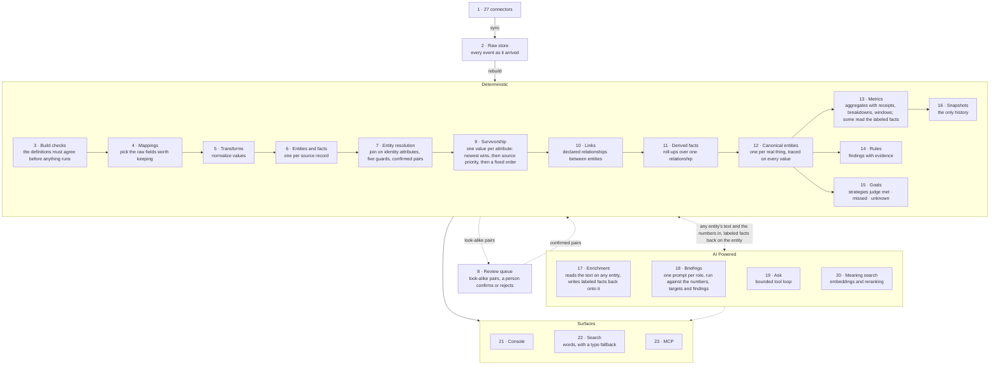

# DW-OS

**An AI Operating System for small businesses, built as code your company owns and evolves.**

- Connects 27 sales, billing, support, marketing and analytics tools
- Raw data kept as it arrived; everything rebuilt from it
- Joins the same customer across tools, with a review queue
- Every number traces to its tool, records and missing fields
- Business logic in nine plain definition files your company owns
- Rules flag what needs attention; goals judge your targets
- Briefings per role, written by a model from finished numbers
- Ask questions in plain English over the same reviewed numbers
- Search everything by words, or by meaning when enabled
- Any AI assistant can read it all through MCP
- A nightly AI engineer proposes fixes; a person approves

**The code in this repository is generated but is carefully reviewed by an engineer. DW-OS is distilled from a broader platform that also runs workflows; workflow support will be introduced in the future.**

[](https://github.com/digital-workers-ai/os/actions/workflows/ci.yml) [](LICENSE)

## Introduction

DW-OS centralizes your sales, billing, support, marketing, spreadsheets, and analytics tools, organizes what it finds, and puts your whole business behind a single pane of glass. From there it calculates your numbers, identifies what needs attention, and tracks whether you are hitting your targets.

Every number calculated can tell you which tool it came from, which records it counted, and which of those records were missing the field. Nothing is a black box, and the same data always gives the same answer.

Every day, the people who run the business can each receive a briefing written for their job: a few paragraphs on what moved, which targets are being hit, and which customers need attention now. An AI model writes those paragraphs, but is handed the finished numbers rather than the database, so it can word them but never invent them.

Every night, an AI agent reviews what changed and opens a GitHub issue for each improvement it finds, with evidence, a plan, and a way to check the result. Nothing changes until a person approves it; then a second agent builds the change in a sandbox and opens a pull request for a human to review and merge. See [An engineer in your loop](#an-engineer-in-your-loop).

## Contents

- [Why](#why)
- [Quickstart](#quickstart)
- [Connectors](#connectors)
- [Architecture](#architecture)
- [Entity Resolution](#entity-resolution)
- [Your Business as Code You Own](#your-business-as-code-you-own)
- [MCP Support](#mcp-support)
- [The Nightly AI Engineer Agent](#the-nightly-ai-engineer-agent)
- [An Engineer in Your Loop](#an-engineer-in-your-loop)
- [For Developers](#for-developers)
- [Configuration](#configuration)
- [Operator Variables](#operator-variables)
- [How a Rebuild Works](#how-a-rebuild-works)
- [Contact](#contact)
- [License](#license)

## Why

A small company runs on a dozen tools and has no single place where any of it is the source of truth. Sales has one Acme, billing has another, support has a third. Nobody can say which name, which owner, or which revenue figure is the real one.

Big companies fix this by hiring a data team. A small company cannot, so it either lives with the mess or buys a dashboard. DW-OS takes a fundamentally different approach to each part of the problem.

- **Immutable raw data:** Every data point from every tool is kept exactly as it arrived, and everything else is rebuilt from it.
- **Every number can be traced:** Which tool, which record, how many rows went into each total, and which ones were missing the field.
- **Business as code:** Your company's operating logic—what a customer is, how revenue is calculated, what counts as a problem, what your targets are—is a codebase: shaped by how your company actually works, built exactly the way you need it, and owned by you.
- **Your AI engineer keeps watch:** Every night an AI agent reviews what changed, finds what is drifting, and writes up fixes with evidence. Nothing is built until you approve it.

## Quickstart

Docker is all you need.

```bash
git clone https://github.com/digital-workers-ai/os.git && cd os
cp app/.env.example app/.env
docker compose -f app/docker-compose.yml up -d --build --wait
curl -X POST localhost:8092/api/sync
curl -X POST localhost:8092/api/rebuild
open http://localhost:3092
```

The two `curl` commands pull from every stand-in tool and then build every record out of what arrived; the last command opens the console on your home page; the dashboard is at http://localhost:3093.

## Connectors

One connector per tool. Each knows how its provider handles sign-in, how it pages through long lists, what shape its answers come back in, and which field holds the tool's own "last changed" time.

In this repository, all of them are answered by stand-ins rather than the real providers. The connector code is real and tested on every change, but this open version reads made-up data instead of a live account. Setting it up on your own tools is work we do with you: [reach out](#contact).

| Category               | Tools                                                    | What comes in                         |
|------------------------|----------------------------------------------------------|---------------------------------------|
| Sales and CRM          | HubSpot, Salesforce, Google Sheets                      | Companies, people, deals              |
| Billing and shops      | Stripe, Shopify, WooCommerce                            | Subscriptions, orders, products, customers |
| Support                | Zendesk, Intercom                                       | Tickets, organisations, people        |
| Email and lifecycle    | Mailchimp, Klaviyo, ActiveCampaign, SendGrid, Customer.io | Campaigns, audiences, profiles, activity |
| Advertising            | Meta, Google Ads, LinkedIn, Pinterest, Snapchat, Twitter | Ad accounts, campaigns, spend, conversions |
| Analytics and product  | Google Analytics, Mixpanel, Amplitude, Segment, Smartlook | Traffic, events, event definitions    |
| Meetings and messaging | Calendly, Zoom, Twilio                                  | Meetings, call transcripts, messages  |

Adding a tool is one package under `app/backend/app/sources/`, its lines in `definitions/mappings.yaml`, and a saved sample response the test suite can replay. Deletions in a provider are not currently detected—a record that disappears upstream stays in the graph.

## Architecture



**Deterministic Layers:**

1. **Connectors:** One per tool, described under [Connectors](#connectors).
2. **Raw store:** Every data point a tool ever sent, kept exactly as it arrived. Nothing here is edited or deleted, and everything below is rebuilt from it.
3. **Build checks:** The definition files, explained below, are checked against each other. If they disagree, nothing runs.
4. **Mappings:** A translation table between each tool's vocabulary and the business. Each line pairs a field in a tool's response with the fact it means here, so "Website" in the CRM and "domain" in support both become a company's domain. Fields without a line are left out.
5. **Transforms:** A fixed list of clean-up functions for domains, emails, money, phone numbers, dates, and statuses.
6. **Entities and facts:** One entity for each record each tool holds, named by the tool, the kind of thing, and the tool's own id for it. A fact has three possible states: the tool never mentioned it, the tool said it's empty, or it has a value.
7. **Entity resolution:** Records are grouped on the fields the definitions say identify a thing, such as a company's domain or a person's work email.
8. **Review queue:** Pairs of records whose names look alike and that share one more clue, such as a phone number or a work-email domain. A person confirms, rejects, or splits them, and each decision triggers a full rebuild.
9. **Survivorship:** When tools disagree about a value, one wins per field: the most recently changed, by the tool's own clock. If two are equally recent, the tool ranked higher in the definitions wins. If still tied, a fixed order by tool name and id decides, so the answer never changes from one run to the next.
10. **Links:** The connections the definitions declare, such as a subscription belonging to a company, drawn only between records that exist after resolution.
11. **Derived facts:** Roll-ups across one connection—one link, one calculation, an optional filter—like a company's revenue from its subscriptions. They sit next to ordinary facts but are marked as calculated, with no tool or raw record behind them.
12. **Canonical entities:** One record per real-world thing, with an id worked out from its content, so the same thing gets the same id on every rebuild.
13. **Metrics:** The numbers your business runs on, defined once and calculated on request, over any date range: monthly revenue, deal count, churned subscriptions, and so on.
14. **Rules:** The things worth a person's attention, written as conditions on a single record (e.g., a subscription past due, a deal past its close date, a paying customer with open tickets). Each rule carries a severity that says how quickly someone wants to know.
15. **Goals:** A metric, a target a person chose, and a way to judge it: at least, at most, rising over the recorded history (which needs at least two points), or within a band around the target.
16. **Snapshots:** The system's memory of its numbers. Each snapshot writes down every metric's value with a timestamp, and the series they form is what charts draw and trend goals judge. Nothing else writes history, and it is never deleted.

**AI-Layered Features:**

17. **Enrichment:** Reads text a tool holds, such as a sales call transcript, and turns it into labeled facts on the record, picking each label from a fixed list and quoting the passage it came from.
18. **Briefings:** A short written summary of the numbers, targets, and findings for one role, such as the owner or the head of sales, written by a model from a prompt file.
19. **Ask:** Type a question and get an answer built from the same reviewed numbers, using seven read-only tools and at most eight rounds of tool calls.
20. **Meaning search:** Finds a transcript by what it was about rather than the exact words, by turning text into vectors and reranking the results. Off until you switch it on.

**Surfaces:**

21. **Console:** The web app: a home page with goals and findings, plus pages for activity, metrics, records, the AI parts, definitions, settings, and search.
22. **Dashboard:** A second web app for readers: the pages `dashboards.yaml` declares, one card per metric, over any date range.
22. **Search:** One search box over everything stored: names, emails, ids, statuses, transcript passages, briefings, and the definitions themselves.
23. **MCP:** The door for AI assistants. Any assistant on your machine can read the same numbers, definitions, and briefing prompts as the console, and every call is logged.

## Entity Resolution

How it works:

```
two records, same kind          (today: people; companies declare no ladder)
          │
          ▼
  1. shared identity?  (email, domain, a corroborated tenant id)
          │ yes ──► MERGE, unless one of the five guards objects
          │ no
          ▼
  2. names look alike?  (similarity ≥ 0.8)
          │ no ────────────────────────────────────► two entities
          │ yes
          ▼
  3. a second attribute agrees?  (phone, email domain)
          │ no ────────────────────────────────────► two entities
          │ yes
          ▼
  4. REVIEW QUEUE  pair + evidence
          │
     ┌────┴─────┐
     ▼          ▼
  confirm     reject
     │          │
     ▼          ▼
  MERGE       two entities, remembered
  (survives rebuilds; each decision rebuilds on the spot;
   unmerge sends it back to 4)
     │
     ▼
  5. every rebuild re-checks the evidence
          │ still holds ────────────────────────────► keep
          │ gone ───────────────────────► keep, but flagged for a look
          │
          ▼
  6. a person measures the confirmed pattern on the test corpus
     and, if it holds, adds the attribute to identity: step 1
```

## Your Business as Code You Own

Everything here is code your company owns: nine definition files that describe the business, and the software underneath that connects to your tools, joins the records, calculates the numbers, and writes the briefings.

The definitions are where most changes happen. They hold what counts as a customer, which fields matter, how revenue is calculated, what counts as a problem, what the targets are, and what questions an AI model is allowed to ask about your text. Every time the system starts, and every time it rebuilds, it checks the files against each other. If one file mentions a field another does not have, or a number over data nothing produces, or a target with a setting that makes no sense, the system refuses to start and says which file and which line. It will not run on definitions it knows are broken.

A business does not stand still, so the code follows it. A tool renames a field and a mapping line changes. A new status appears and a synonym line folds it in. You start caring about a number you never tracked and a metric line defines it. You sign up for a tool nobody supports yet and a connector gets written. What you run on day one is tailored to your company, and a year later it is still tailored, because it has changed every time the company did.

Because all of it lives in a repository, your business is versioned. Changing what revenue means is a proposal with a before and after, a reviewer, and a date. Months later, the history still says who changed it and when. That matters more than it sounds: when a number moves, you can tell whether the business moved or the definition did. No dashboard can answer that.

```
┌─────────────────┬───────────────────────────────────────────────────────────────────────────────────────┐
│      File       │                                    What it decides                                    │
├─────────────────┼───────────────────────────────────────────────────────────────────────────────────────┤
│ ontology.yaml   │ What kinds of thing exist, what details each one has, which details identify it,      │
│                 │ which tool wins a tie, how things connect, and what every label means                 │
├─────────────────┼───────────────────────────────────────────────────────────────────────────────────────┤
│ mappings.yaml   │ Which field from which tool becomes which fact here                                   │
├─────────────────┼───────────────────────────────────────────────────────────────────────────────────────┤
│ transforms.yaml │ How each kind of value is cleaned up, picked from a fixed list                        │
├─────────────────┼───────────────────────────────────────────────────────────────────────────────────────┤
│ synonyms.yaml   │ Which spellings from different tools mean the same status                             │
├─────────────────┼───────────────────────────────────────────────────────────────────────────────────────┤
│ derived.yaml    │ The roll-ups, like a company's revenue from its subscriptions                         │
├─────────────────┼───────────────────────────────────────────────────────────────────────────────────────┤
│ metrics.yaml    │ The numbers your business runs on, and how each is calculated                         │
├─────────────────┼───────────────────────────────────────────────────────────────────────────────────────┤
│ rules.yaml      │ What counts as worth a person's attention                                             │
├─────────────────┼───────────────────────────────────────────────────────────────────────────────────────┤
│ goals.yaml      │ The targets, and how each one is judged                                              │
├─────────────────┼───────────────────────────────────────────────────────────────────────────────────────┤
│ dashboards.yaml │ The pages of the dashboard, and which numbers each one shows                         │
├─────────────────┼───────────────────────────────────────────────────────────────────────────────────────┤
│ enrichment.yaml │ The questions a model may ask of your text, and the answers it may give              │
└─────────────────┴───────────────────────────────────────────────────────────────────────────────────────┘
```

Briefings follow the same idea. A briefing is a few paragraphs a model writes for one job—the owner or the head of sales—saying what moved, which targets are on track, and which customers need attention. Each morning it is written fresh and each person gets a notification with theirs. What a job's briefing talks about is set by a short prompt file in plain English: what that reader cares about, in what order, at what length. One file per job, and the file is the job. Add one for the CFO and there is a CFO briefing; delete it and there is not. The prompt is versioned like everything else here, so a briefing that reads differently this month can be traced to the day someone changed the wording.

## MCP Support

Any AI assistant can use DW-OS as a tool. It gets read-only access to the same reviewed numbers the console shows, so when you ask your assistant about revenue it reports the number your system agreed on rather than guessing over raw tables. It can also read the definition files, so it can check what a number means before quoting it.

```
claude mcp add --transport http os http://localhost:3092/mcp
```

## The Nightly AI Engineer Agent

Once a day, an AI agent reviews the whole system for what quietly rots—a field nothing reads any more, two tools spelling one status differently, a merge whose evidence has disappeared, a number that jumped for no reason, a target stuck on unknown, a rule that never fires—and writes up the smallest change that would fix each one.

It is off until a person switches it on; see [Operator Variables](#operator-variables). Once enabled, it runs as a Claude Code session in GitHub Actions (`.github/workflows/operator.yml`, scheduled at 06:00 UTC) with the repository checked out and last night's database copy restored beside it. It reads `sync_run` per source, the two newest rebuild reports, the newest payload per record (object types no mapping reads, fields nothing maps, the status vocabulary each source uses), clusters that disagree on a name or an email, candidates pending over a week, confirmed pairs whose evidence is gone, hand-made merge decisions, snapshot series that jumped or turned null, goals stuck on unknown, rules that never fire, conversation turns, agent tool calls, failed briefings, and the briefs against who is asking.

A proposal is a GitHub issue labeled `operator` + `awaiting-approval`, carrying the query, its result, and—where possible—the number before and after a trial edit, plus a plan a builder can follow without the operator and a verify step.

Nothing is built until a person applies `approved` or replies LGTM; then `operator-build.yml` implements the plan and opens the pull request that closes the issue, and a person merges. The operator never commits, never branches, and never applies `approved` itself. Production is never touched: it reads a restored copy in the runner's own Postgres, may edit a definition and rebuild the copy for before-and-after evidence, and the copy dies with the runner. Where that copy comes from is set under [Operator Variables](#operator-variables).

The trail of `operator` issues is its memory: open is pending, closed without `approved` is declined, and a declined subject returns only with new evidence, named. Its model and brief are in `agents/operator.yaml`; the rules it may not edit are in `.claude/skills/dw-operator` and `dw-operator-build`.

## An Engineer in Your Loop

The nightly agent is only half of the arrangement. A write-up is not a change. It is a proposal with evidence attached, and somebody has to judge whether that evidence is any good.

That is the part we do. At Digital Workers, we read every proposal the nightly agent makes about your system before anything is built. We check that the evidence shows what the agent says it shows, that the change is the smallest one that fixes the problem, and that it did not reach for new code where a definition line would do. A proposal that does not hold up is closed with the reason written down, so the same idea cannot come back without new evidence. One that does hold up gets approved, built in a sandbox, and handed to a person to merge.

## For Developers

```
./test.sh unit    # lint, then the full suite at 100% line and branch coverage
./test.sh e2e     # against the live mock providers
./test.sh snap    # Playwright screenshots against the committed baselines
./format.sh       # apply lint fixes and formatting
```

## Configuration

Everything is read from the environment, and `app/.env` is loaded first. Every setting has a default, so an empty file runs. The three API keys are never settings, and the app refuses to start a layer whose key is missing.

| Variable                   | Default                                         | What it does                                                           |
|----------------------------|-------------------------------------------------|------------------------------------------------------------------------|
| `DATABASE_URL`             | `postgresql+asyncpg://os:os@localhost:5442/os`  | Postgres connection; compose points it at the `postgres` service        |
| `MOCK_BASE_URL`            | `http://localhost:8192`                         | Where the vendored mock providers answer                                |
| `SYNC_RUN_RETENTION_DAYS`  | `30`                                            | Sync runs older than this are pruned                                   |
| `ENGINE_RUN_RETENTION`     | `200`                                           | Rebuild receipts kept                                                  |
| `CONNECTOR_MAX_PAGES`      | `500`                                           | Pages a connector pulls per object type before stopping                |
| `CONNECTOR_MAX_BYTES`      | `52428800`                                      | Payload bytes a connector accepts per pull                             |
| `ER_BUCKET_CAP`            | `50`                                            | Records per identity bucket before resolution refuses to merge it      |
| `ER_ONE_RECORD_PER_SOURCE` | `true`                                          | A canonical entity holds at most one record per source                 |
| `ENRICHMENT_ENABLED`       | `false`                                         | Enriches entities with inferred metadata                               |
| `ENRICHMENT_MODEL`         | `claude-sonnet-5`                               | Model for enrichment                                                   |
| `ENRICHMENT_MAX_TOKENS`    | `8000`                                          | Output cap per enrichment call                                         |
| `ENRICHMENT_MAX_CALLS_PER_RUN` | `200`                                      | Model calls per enrichment run                                         |
| `ENRICHMENT_CONCURRENCY`   | `4`                                             | Enrichment calls in flight at once                                     |
| `COACHING_ENABLED`         | `false`                                         | Generate role briefings                                                |
| `COACHING_MODEL`           | `claude-sonnet-5`                               | Model for briefings                                                    |
| `COACHING_MAX_TOKENS`      | `8000`                                          | Output cap per briefing                                                |
| `CONVERSATION_ENABLED`     | `false`                                         | The ask agent                                                          |
| `CONVERSATION_MODEL`       | `claude-sonnet-5`                               | Model for the ask agent                                                |
| `CONVERSATION_MAX_TOKENS`  | `8000`                                          | Output cap per turn                                                    |
| `CONVERSATION_MAX_TURNS`   | `8`                                             | Tool-call rounds per question                                          |
| `CONVERSATION_MAX_TOOL_RESULT_CHARS` | `12000`                             | A tool result is truncated beyond this                                 |
| `CONVERSATION_MAX_HISTORY_TURNS`   | `12`                                  | Earlier turns replayed to the model                                    |
| `CONVERSATION_MAX_TURN_CHARS`      | `4000`                                 | A stored turn is truncated beyond this                                 |
| `EMBEDDINGS_ENABLED`       | `false`                                         | Meaning search over transcript chunks                                  |
| `EMBEDDING_MODEL`          | `text-embedding-3-small`                        | Embedding model                                                        |
| `EMBEDDING_DIMS`           | `1536`                                          | Vector width; must match the column                                    |
| `EMBEDDING_BATCH`          | `100`                                           | Chunks per embedding request                                           |
| `EMBEDDINGS_MAX_CALLS_PER_RUN` | `200`                                     | Embedding requests per run                                             |
| `RERANK_ENABLED`           | `false`                                         | Rerank hybrid search results                                           |
| `RERANK_MODEL`             | `zerank-2`                                      | Reranker model                                                         |
| `RERANK_TOP`               | `20`                                            | Results sent to the reranker                                           |
| `SEARCH_CHUNK_CHARS`       | `1200`                                          | Target size of a transcript chunk                                      |
| `CLOCK_PINNED_AT`          | unset                                           | Pins the app clock at one instant                                      |

| Key                   | Needed by                                  |
|-----------------------|--------------------------------------------|
| `ANTHROPIC_API_KEY`   | Reading text, briefings, asking questions  |
| `OPENAI_API_KEY`      | Meaning search                             |
| `ZEROENTROPY_API_KEY` | Reranking                                  |

## Operator Variables

The nightly agent and its builder run only when the repository variable `OPERATOR_ENABLED` is `true` and the two secrets below are set; until then both workflows are skipped. These are GitHub Actions repository variables and secrets read by `.github/workflows/operator.yml` and `operator-build.yml`, not app settings. The agent restores last night's database copy from object storage: set the S3 or the GCS pair, never both; with neither set, the run syncs the mock providers and audits that instead.

| Variable                                  | Kind     | What it does                                                                 |
|-------------------------------------------|----------|------------------------------------------------------------------------------|
| `OPERATOR_ENABLED`                        | variable | `true` switches both workflows on; anything else and every run is skipped    |
| `OPERATOR_SNAPSHOT_S3`                    | variable | `bucket/path/to/os.dump`, a `pg_dump` custom-format file on S3               |
| `OPERATOR_AWS_ROLE_ARN`                   | variable | Role assumed through OIDC to read it; the region is `us-east-1`              |
| `OPERATOR_SNAPSHOT_GCS`                   | variable | `bucket/path/to/os.dump` on Cloud Storage                                    |
| `OPERATOR_GCP_WORKLOAD_IDENTITY_PROVIDER` | variable | Workload identity provider the runner authenticates through                  |
| `OPERATOR_GCP_SERVICE_ACCOUNT`            | variable | Service account it impersonates to read the dump                             |
| `ANTHROPIC_API_KEY`                       | secret   | The operator's model                                                         |
| `OPERATOR_GITHUB_PAT`                     | secret   | Token the operator uses to open issues and the builder to open pull requests |

## How a Rebuild Works

A rebuild is the step that turns the raw store into everything above it.

It starts by checking the definition files against each other. Those files are read live from disk, and editing one then rebuilding is the normal way to make a change, so a typo is caught before anything is wiped.

Then it wipes the whole derived layer and recomputes it. For each record, it takes the newest payload the tool ever sent, in the order records were first seen, so the same customer gets the same id every time. From there the steps run in the order on the diagram: mappings pick the fields, transforms clean the values, entities and facts are built, records are joined, disagreements are settled, links are drawn, roll-ups are calculated, and the result is written. Four things a rebuild never touches: the raw store, the snapshots, anything the AI parts wrote, and the decisions people made in the review queue.

After the write, the search index is refilled, the look-alike pairs are regenerated, and a receipt of the run is saved with its full report. If meaning search is switched on, the vectors are refreshed last.

## Contact

Running DW-OS on your own tools, need a connector for something that is not on the list, or have questions worth a conversation? Happy to help.
Email: hello@hiredigitalworkers.com

## License

AGPL-3.0, see `LICENSE`.
