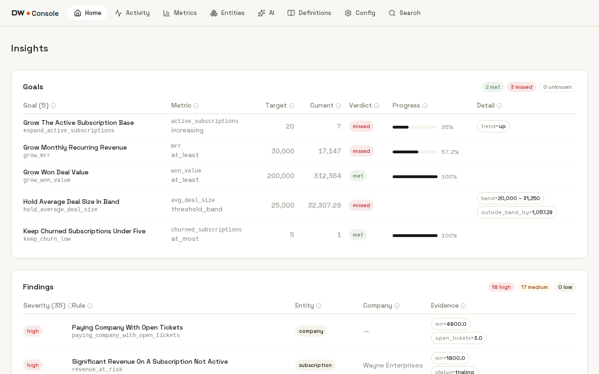
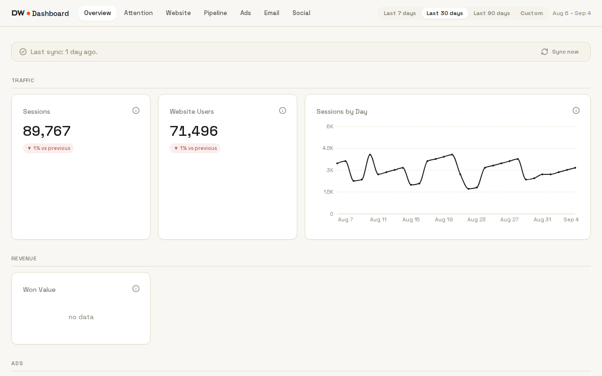
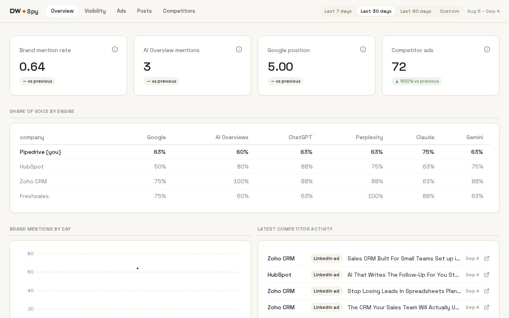
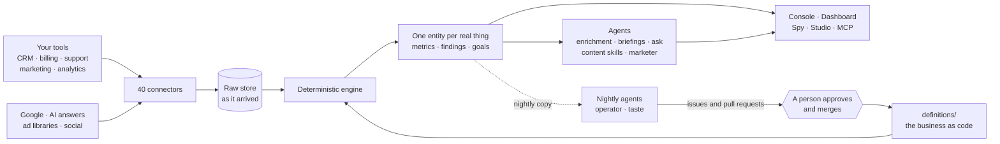

# DW-OS

**A company operating system for small businesses. AI agents do the routine work, a person approves every change, and the whole business is code your company owns.**

- Connects 40 tools: sales, billing, support, marketing, analytics, and the places competitors show up
- Keeps every record exactly as it arrived, and rebuilds everything else from it
- Joins the same customer across tools, with a review queue for the close calls
- Traces every number to its tool, its raw fields, and how many records were missing a value
- Holds the business logic in 13 definition files your company owns and reviews like code
- Flags what needs attention and judges your targets
- Writes a briefing per role from finished numbers, and answers questions over the same numbers
- Tracks the brand in Google and AI answers, and what competitors advertise and post
- Makes the marketing from your brand files, with every claim sourced
- Lets any AI assistant use it through MCP
- Runs a nightly AI engineer that proposes fixes for a person to approve

**The code in this repository is generated but is carefully reviewed by an engineer. DW-OS is distilled from a broader platform that also runs workflows; workflow support will be introduced in the future.**

[](https://github.com/digital-workers-ai/os/actions/workflows/ci.yml) [](LICENSE)

## What it is

A small company runs on a dozen tools and has no single place where any of it is the source of truth. Sales has one Acme, billing has another, support has a third, and nobody can say which name, owner or revenue figure is the real one. Big companies hire a data team for this. DW-OS does that team's work in software, and hands the routine work around it to AI agents.

It has four parts, all in this repository:

- **Data.** 40 connectors pull every record from your tools into a raw store that only grows.
- **Definitions.** YAML and Markdown files say what a customer is, how revenue is calculated, what counts as a problem, what the targets are, and how the brand sounds. A deterministic engine reads them and turns the raw records into one entity per real-world thing, with every number, finding and verdict computed from it. The same data always gives the same answer.
- **Agents.** Models do the work that needs language, from what the engine produced: they label call transcripts, write briefings, answer questions, make the marketing, and every night review the system itself for what should change.
- **People.** A person confirms which records are the same customer, approves each change an agent proposes, and merges it. Nothing an agent writes reaches your tools, and nothing publishes on its own.

## The apps

<table>
<tr>
<td width="50%" valign="top">
<a href="docs/console.md"></a>
<p><b><a href="docs/console.md">Console</a></b> · port 3092<br>For whoever operates it. Sync the tools, rebuild, decide which records are one customer, and read the receipts behind every number and definition.</p>
</td>
<td width="50%" valign="top">
<a href="docs/dashboard.md"></a>
<p><b><a href="docs/dashboard.md">Dashboard</a></b> · port 3093<br>For whoever runs the business. The pages <code>dashboards.yaml</code> declares, over any date range, compared with the period before. Installs as an app.</p>
</td>
</tr>
<tr>
<td width="50%" valign="top">
<a href="docs/spy.md"></a>
<p><b><a href="docs/spy.md">Spy</a></b> · port 3094<br>For whoever looks after the brand. How it comes up in Google and five AI engines, and what competitors run in four ad libraries and post on four networks.</p>
</td>
<td width="50%" valign="top">
<a href="docs/studio.md"></a>
<p><b><a href="docs/studio.md">Studio</a></b> · port 3095<br>For whoever markets the business. Posts, newsletters, blog posts, images and carousels made by content skills from your brand files, on request or on a calendar.</p>
</td>
</tr>
</table>

Any AI assistant can use the same numbers, definitions and skills through the [MCP server](docs/mcp.md) at `/mcp`.

## How it fits together


```mermaid
flowchart LR
    TOOLS["Your tools<br/>CRM · billing · support<br/>marketing · analytics"] --> CONN["40 connectors"]
    WEB["Google · AI answers<br/>ad libraries · social"] --> CONN
    CONN --> RAW[("Raw store<br/>as it arrived")]
    RAW --> ENG["Deterministic engine"]
    DEF["definitions/<br/>the business as code"] --> ENG
    ENG --> NUM["One entity per real thing<br/>metrics · findings · goals"]
    NUM --> AG["Agents<br/>enrichment · briefings · ask<br/>content skills · marketer"]
    NUM --> APPS["Console · Dashboard<br/>Spy · Studio · MCP"]
    AG --> APPS
    NUM -.->|nightly copy| NIGHT["Nightly agents<br/>operator · taste"]
    NIGHT -->|issues and pull requests| PPL{{"A person approves<br/>and merges"}}
    PPL --> DEF
```

| Layer | What it is | Where it lives | Read more |
|---|---|---|---|
| Data | 40 connectors, the raw store, sync, the stand-in providers | `app/backend/app/sources/`, `mock/` | [Connectors](docs/connectors.md) |
| Definitions | 13 YAML files, role briefs, brand files, looks, prompts | `definitions/` | [Definitions](docs/definitions.md) |
| Engine | Rebuild, entity resolution, survivorship, metrics, rules, goals, snapshots, search | `app/backend/app/engine/` | [Architecture](docs/architecture.md) |
| Agents | Enrichment, briefings, ask, content skills, marketer, operator, builder, taste agent | `app/backend/app/`, `agents/`, `.claude/skills/`, `.github/workflows/` | [Agents](docs/agents.md) |
| Apps | Console, dashboard, Spy, studio, MCP | `app/console/`, `app/dashboard/`, `app/spy/`, `app/studio/`, `app/backend/app/mcp.py` | Each app's page |
| Approval | The review queue, admin approval of proposals, pull request merges | Console, GitHub | [Where a person decides](docs/agents.md#where-a-person-decides) |

## The agents

| Agent | Runs | Produces | A person |
|---|---|---|---|
| Enrichment | When called | Labels from a fixed list on call transcripts and tickets, each with a verbatim quote | Owns the questions and labels |
| Briefings | When called | A briefing per role, written from finished numbers | Owns each role's brief |
| Ask | Per question | An answer from seven read-only tools | Asks |
| Content skills | On request, calendar or MCP | An asset with its claims and evidence, or a held run saying what was missing | Edits, leaves feedback |
| Marketer | Daily | One asset per empty calendar slot | Skips slots, edits |
| Operator | Nightly, in GitHub Actions | GitHub issues proposing the smallest fix, with evidence | Approves or declines |
| Builder | On approval | A pull request that implements the plan, tests first | Reviews and merges |
| Taste agent | Nightly, in GitHub Actions | A pull request adding one lesson to a skill, after three matching corrections | Merges or closes |

Every agent is off until a person switches it on. Agents in the app never query the database, the nightly agents work on a disposable copy of it, and every change to the definitions, skills or code goes through a pull request a person merges. At Digital Workers, we read every proposal the nightly agent makes before anything is built; see [An engineer in your loop](docs/agents.md#an-engineer-in-your-loop).

## Principles

- **Raw data is kept as it arrived.** Everything else is rebuilt from it, so a corrected definition applies to every record ever received.
- **Every number can be traced**: which tool, which raw fields, how many records went into it, and how many were missing the field.
- **The engine calculates, and agents write.** A model is handed finished numbers, so it can word them and has nothing to calculate from.
- **The business is code.** What revenue means is a line in a file with a history, a reviewer and a date.
- **A person approves.** Agents propose; people merge.

## Quickstart

Docker is all you need.

```bash
git clone https://github.com/digital-workers-ai/os.git && cd os
cp app/.env.example app/.env
docker compose -f app/docker-compose.yml up -d --build --wait
curl -X POST localhost:8092/api/sync
curl -X POST localhost:8092/api/rebuild
open http://localhost:3092
```

The two `curl` commands pull from every connector's stand-in and build every record from what arrived. The console opens on its home page; the dashboard is at http://localhost:3093, Spy at http://localhost:3094 and the studio at http://localhost:3095. To give an AI assistant access:

```bash
claude mcp add --transport http os http://localhost:3092/mcp
```

Setting a source's keys in `app/.env` makes it read the real tool; switching on a model layer takes a setting and an API key. See [Configuration](docs/configuration.md).

## What is on out of the box

| Part | State | To change it |
|---|---|---|
| Connectors, raw store, rebuild, metrics, rules, goals, word search, MCP data tools | On, against the stand-ins | Set a source's keys to read the real tool |
| Enrichment, briefings, the ask agent, meaning search, reranking | Off | A setting and an API key each |
| Studio skill runs and the marketer | Off | `STUDIO_ENABLED` with two keys; `MARKETER_DAILY` |
| Operator, builder and taste agent | Off | Repository variables and secrets ([setup](docs/agents.md#setting-up-the-github-agents)) |
| Scheduling | Only the marketer runs on a timer | Sync, rebuild, snapshots, enrichment and briefings are started by a person or a script |
| Authentication | None | Keep the stack on localhost or behind your own network boundary (`SECURITY.md`) |

## DW-OS in company-OS terms

DW-OS is one working answer to ideas written about as the semantic layer, the context layer and the company OS. Where each idea lives here:

| Idea | In DW-OS |
|---|---|
| [Semantic layer](https://motherduck.com/blog/context-layer-vs-semantic-layer-ontology/): governed metrics every consumer shares | `metrics.yaml` and `derived.yaml`, computed by one engine for every app, agent and MCP client. `slice_metric` lets an agent choose parameters without writing a query. |
| [Ontology as a system](https://www.dataengineeringweekly.com/p/an-ontology-for-ai-agents-is-a-system): entities, identity and relationships, with a loop that verifies knowledge | `ontology.yaml` with 24 entity types, identity attributes and relationships; entity resolution with five guards; the review queue as the verify step |
| [Context layer](https://www.kaelio.com/blog/building-a-context-layer-for-the-agentic-era): YAML and Markdown context in git, reviewed like code | `brand/`, `briefs/`, `prompts.yaml` and `enrichment.yaml`: what agents read before they act, versioned with everything else |
| [Company as code](https://kortix.com/company-as-code): agents, skills and memory as files | `agents/*.yaml` for the nightly agents, `.claude/skills/` for content and workflow skills, the operator's issue trail as its memory |
| [Agentic company OS](https://arxiv.org/abs/2609.13334): data, knowledge, intelligence and governance layers | Connectors and the raw store; definitions; agents; the review queue and approvals |
| [Agentic software factory](https://www.bcgplatinion.com/insights/the-agentic-software-factory): agents triage, plan and build, people gate | Operator (triage and plan) → admin approval → builder (tests first) → a person merges |
| [Context graphs](https://foundationcapital.com/ideas/why-context-graphs-are-the-missing-layer-for-ai): decision traces as a compounding asset | Partly: review-queue decisions are kept and re-applied on every rebuild, and the operator's issue trail keeps each proposal's evidence and outcome; there is no general decision log yet |

## Documentation

| Page | Covers |
|---|---|
| [Console](docs/console.md) | The operator's app, page by page, and what each button does |
| [Dashboard](docs/dashboard.md) | The reader's app, `dashboards.yaml`, date ranges, installing it |
| [Spy](docs/spy.md) | Brand visibility, competitor ads and posts, `spy.yaml`, mention detection |
| [Studio](docs/studio.md) | Content skills, claims and held runs, brand and looks, the marketer and taste agent |
| [MCP](docs/mcp.md) | Tools, resources and prompts for AI assistants |
| [Architecture](docs/architecture.md) | Sync, the rebuild, entity resolution, survivorship, metrics, rules, goals, snapshots |
| [Definitions](docs/definitions.md) | Every definition file, the build checks, and how a change flows |
| [Agents](docs/agents.md) | Every agent, the two loops, and where a person decides |
| [Connectors](docs/connectors.md) | All 40 sources, real or stand-in, and how to add one |
| [Configuration](docs/configuration.md) | Every setting, key and repository variable |

## Repository layout

```
app/backend/       FastAPI: connectors, engine, AI layers, MCP, routes, tests
app/console/       Console (React)
app/dashboard/     Dashboard (React, installable)
app/spy/           Spy (React)
app/studio/        Studio (React)
app/renderer/      Chromium service that renders studio images
app/e2e/           Playwright specs and the committed screenshots used in these docs
definitions/       The business as code
agents/            The nightly agents' models and briefs
.claude/skills/    Content skills and the agents' workflow skills
mock/              Stand-in providers and the entity-resolution test corpus
.github/           CI, the CLA check, and the operator and taste workflows
docs/              This documentation
```

## For developers

```
./test.sh unit           lint, then the full suite at 100% line and branch coverage
./test.sh e2e            against the live stand-in providers
./test.sh snap           Playwright screenshots of all four apps against the committed baselines
./test.sh snap-update    accept new baselines
./format.sh              apply lint fixes and formatting
```

`CONTRIBUTING.md` has the setup, the rules (no comments, red before green, small pull requests) and the schema-change steps. `CLAUDE.md` and the `dw-*` skills are the same rules for coding agents.

## Contact

Running DW-OS on your own tools, need a connector for something that is not on the list, or have questions worth a conversation? Happy to help.
Email: hello@hiredigitalworkers.com

## License

Copyright (C) 2026 Digital Workers LLC.

DW-OS is free software under the GNU Affero General Public License v3.0, see `LICENSE`. You can run it, change it, and keep your changes to yourself. What the license asks is that anyone you give a modified copy to, or let use one over a network, can get its source.

A commercial license is available for companies that need to keep their changes private, or want custom development and support: hello@hiredigitalworkers.com.

Outside contributions are accepted under `CLA.md`.
