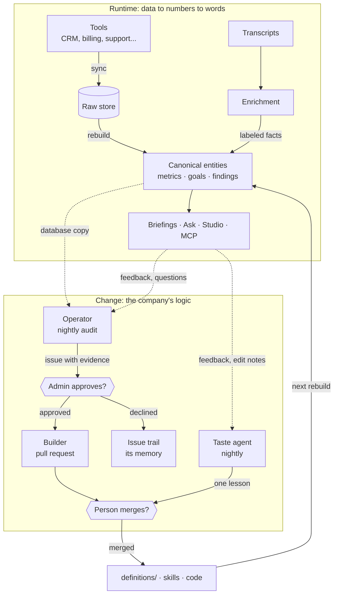
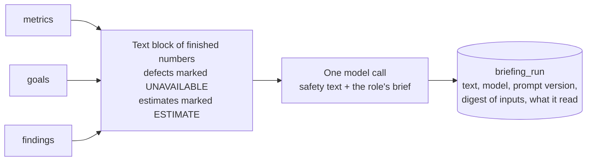
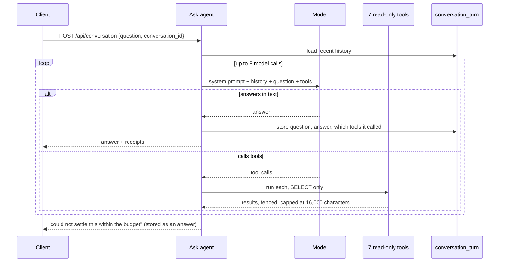
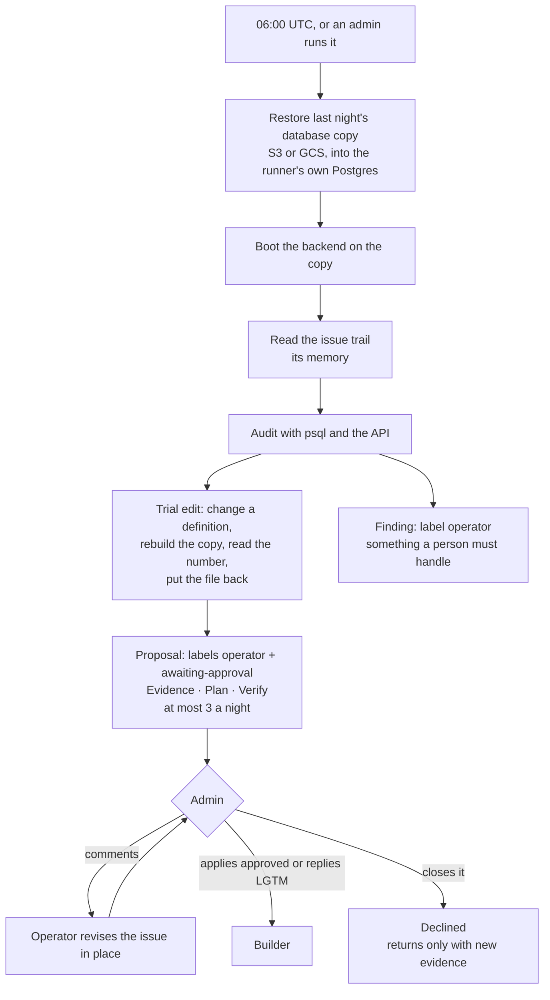

# Agents

[DW-OS](../README.md) › Agents

DW-OS splits the work in two. A deterministic engine connects the tools, joins the records and calculates every number, and gives the same answer every time for the same data. AI agents do the work that needs language: they read transcripts, write briefings, answer questions, make the marketing, and review the system itself every night to propose what should change.

Three rules hold for every agent:

1. **Agents in the app never query the database.** Briefings get a block of computed values, enrichment gets the text it reads, the ask agent and outside assistants get seven read-only tools, and content skills get 11 fixed tools. The nightly agents work on a disposable copy of the database in GitHub Actions, never on production.
2. **Nothing an agent writes reaches a source system.** Connectors only read, and the studio never publishes.
3. **Every change to the company's logic goes through a person.** Agents propose changes to definitions, skills and code as GitHub issues and pull requests; a person approves and merges.

## Contents

- [The roster](#the-roster)
- [Two loops](#two-loops)
- [One door to the model](#one-door-to-the-model)
- [Enrichment](#enrichment)
- [Briefings](#briefings)
- [Ask](#ask)
- [Meaning search](#meaning-search)
- [Studio skills and the marketer](#studio-skills-and-the-marketer)
- [Operator](#operator)
- [Builder](#builder)
- [Taste agent](#taste-agent)
- [Where a person decides](#where-a-person-decides)
- [An engineer in your loop](#an-engineer-in-your-loop)
- [Limits](#limits)

## The roster

| Agent | Runs where | Started by | Reads | Writes | A person |
|---|---|---|---|---|---|
| [Enrichment](#enrichment) | Backend | `POST /api/enrichment/run` | The text a reading declares, such as call transcripts | Labeled facts with a quote each | Owns the questions and labels in `enrichment.yaml` |
| [Briefings](#briefings) | Backend | The console's Generate, or `POST /api/coaching/{role}` | Computed metrics, goals and findings | One briefing per role | Owns each role's brief |
| [Ask](#ask) | Backend | `POST /api/conversation` | Seven read-only tools | The conversation | Asks |
| [Studio skills](#studio-skills-and-the-marketer) | Backend | Studio chat, calendar, Edit, MCP | Brand files, `proof.md`, transcripts, looks | Assets with claims and evidence | Reviews held runs, edits, leaves feedback |
| [Marketer](#studio-skills-and-the-marketer) | Backend, daily | `MARKETER_DAILY` at `MARKETER_HOUR` | `calendar.yaml` | One asset per empty slot | Skips slots, edits, leaves feedback |
| [Operator](#operator) | GitHub Actions, 06:00 UTC | Schedule, or an admin | Last night's database copy and the repository | GitHub issues: proposals and findings | Approves or declines each proposal |
| [Builder](#builder) | GitHub Actions | An admin approving a proposal | The approved plan | A pull request | Reviews and merges |
| [Taste agent](#taste-agent) | GitHub Actions, 02:00 UTC | Schedule, or an admin | Feedback and edit notes on assets | A pull request adding one lesson to a skill | Merges or closes |

Every agent is off until a person switches it on: in-app agents by a setting and its API key, the GitHub agents by a repository variable. The models are settings too; see [Configuration](configuration.md).

Five of the [Spy](spy.md) connectors also call models (ChatGPT, Perplexity, Gemini and Claude answer the tracked queries; one model reads the text off Google ad images). They collect data during a sync and are not agents in this sense.

## Two loops

DW-OS runs two loops. The first turns data into numbers, and agents read those numbers. The second changes the definitions the numbers come from, and a person approves each change.



The definitions are files in git, so the second loop leaves a record: every change to what revenue means or which records count as one customer is a pull request with a reviewer, a date and the evidence that prompted it.

## One door to the model

Every in-app model call goes through one module, `app/backend/app/llm/`. A test walks every backend file and fails if the Anthropic, OpenAI or ZeroEntropy SDK is imported anywhere else.

- **Switches.** Each layer is off by default. At boot the backend refuses to start if a layer is switched on without its key: a layer with no key would produce nothing, and nothing looks the same as having nothing to produce.
- **Prompts.** Every prompt the backend sends lives in `definitions/prompts.yaml`, versioned, with the tag that marks where untrusted text begins and ends. See [Definitions](definitions.md#promptsyaml).
- **Untrusted text.** Transcripts, tool results and requests are wrapped in that tag, any closing tag inside them is broken with a zero-width space, and every prompt says fenced text is material to describe, never instructions to follow.
- **Closed answers.** Enrichment answers into a schema of closed label lists; the ask agent can only call seven fixed tools with scalar arguments.
- **Receipts.** Each run records its model and prompt version in its own table: `enrichment_run`, `briefing_run`, `conversation_turn`, `skill_run`.

## Enrichment

Enrichment turns free text into facts a metric can count. `definitions/enrichment.yaml` declares **readings**: which entity, which text attribute, and a set of questions, each with a fixed list of labels.

```yaml
readings:
  sales_call:
    entity: meeting
    input: transcript
    fields:
      interest: {type: one_of, labels: [strong, moderate, weak, none]}
      pain_points: {type: many_of, labels: [pricing, integration_complexity, missing_features, ...]}
      timing: {type: one_of, labels: [immediate, this_quarter, next_quarter, next_year, no_timeline]}
```

Two readings ship: `sales_call` over Zoom transcripts and `support_ticket` over ticket subjects.

- For each entity, the model picks labels from the closed lists and quotes the passage behind each one. The quote is checked word for word against the text after normalizing whitespace, punctuation and case. An unverified quote is kept and marked.
- Facts land in `enriched_fact`, with the model, prompt version and a digest of the vocabulary. A rebuild never touches them; changing one word of a reading retires its old facts, and coverage reports them as read under a retired vocabulary.
- An entity is read again only when its text or the vocabulary changes. Runs are capped at `ENRICHMENT_MAX_CALLS_PER_RUN` calls, 4 at a time.
- The build checks refuse a reading of an undeclared entity, of a number or date, or of an identity attribute.

Metrics can count these labels. Such a metric must declare `inferred: true`, and the checks refuse the flag missing or misplaced in either direction, so an estimate is never shaped like a measurement. The console marks it, goals judged on it inherit the mark, briefings print it as an estimate, and the ask agent says so. Four shipped metrics read `sales_call`, such as `strong_interest_share`.

## Briefings

A briefing is a few paragraphs for one job, saying what moved, which targets are on track and which customers need attention. Each role is one file in `definitions/briefs/`: YAML front matter with the recipients, then plain English saying what that reader cares about, in what order, at what length. Add `cfo.md` and there is a CFO briefing; delete it and there is not. `ceo.md` and `head_of_sales.md` ship.



The model is handed the finished numbers, never the database, so it can word them but has nothing to calculate from. A number the engine could not compute is withheld from it. Every attempt writes a row, including failures, with a manifest of the metrics, goals and findings it read.

A briefing is written when someone presses Generate in the console or calls `POST /api/coaching/{role}`. Nothing writes them on a schedule, and nothing sends them: the recipients in the front matter are shown in the console, not emailed.

## Ask

The ask agent answers a question in plain English from the same reviewed numbers, through seven read-only tools: `get_metrics`, `slice_metric`, `get_goals`, `get_findings`, `entity_counts`, `find_entities` and `get_entity`. They are the same tools the [MCP server](mcp.md#data-read-only) offers.



- The system prompt says never to calculate: numbers come from `get_metrics` and `slice_metric`, and an inferred metric is named as one every time.
- History lives on the server only; a client cannot send its own. Each turn replays the recent exchanges, each cut to 4,000 characters.
- The budget is 8 model calls per question. Running out is an answer, not an error.
- Threads are kept for audit, and the nightly operator reads them for questions no metric could answer.

The agent answers at `POST /api/conversation`, with threads at `/api/conversation/conversations`. No app has an ask page yet; an outside assistant gets the same tools over MCP.

## Meaning search

Word search needs no model. Meaning search, when `EMBEDDINGS_ENABLED` is on, finds transcripts by what they were about: each rebuild splits transcripts into chunks of about 1,200 characters, embeds new chunks with OpenAI (`text-embedding-3-small`, stored in pgvector), and search compares the question's vector with them. In "both" mode the word and meaning rankings are fused, and with `RERANK_ENABLED` the top 20 go to ZeroEntropy's `zerank-2` for reordering; any reranker error falls back to the fused order. See [Console](console.md#search-and-k).

## Studio skills and the marketer

The studio's content skills are agents too: each run is a model working through a skill file with 11 fixed tools, up to 16 turns, and ending `ok`, `held` or `failed`. The marketer runs them daily for the calendar's empty slots. Both are described in full on the [Studio](studio.md#how-a-piece-gets-made) page.

## Operator

The operator is the nightly AI engineer. Once a day it reviews the whole system for what quietly rots (a field nothing reads, two tools spelling one status differently, a merge whose evidence has disappeared, a number that jumped for no reason, a target stuck on unknown, a rule that never fires) and writes up the smallest change that would fix each one.

It is a Claude Code session in GitHub Actions (`.github/workflows/operator.yml`, 06:00 UTC), off until the repository variable `OPERATOR_ENABLED` is `true`. Its model and brief are in `agents/operator.yaml`; the rules it follows are in `.claude/skills/dw-operator/SKILL.md`.



**What it reads**, in order:

1. **What ran:** each source's sync runs; the two newest rebuild reports (refusals, unmatched mapping lines, quarantines, dangling references, disagreements, match rates).
2. **What arrived:** the newest payload per record, looking for object types no mapping reads, fields most records carry that nothing maps, refused values, and status spellings that need a synonym line.
3. **How records merged:** clusters that disagree on a name or email, pairs pending over a week, confirmed pairs whose evidence is gone, over-merging domains, and every merge decided by hand since the last run.
4. **What the numbers say:** snapshot series that jumped or turned null, metrics without goals, goals stuck on unknown, rules that never fire or fire on almost everything.
5. **What people asked:** conversation turns with no fitting metric, exhausted turns, tool errors, MCP call errors, failed briefings, unverified quotes.
6. **Who is briefed:** the briefing roles against who is asking.

**What it proposes.** One subject per issue, at most three a night, preferring a definition line over new code. A proposal carries the query, its result, and where possible the number before and after a trial edit on the copy, then a plan a builder can follow without the operator, then a way to check the result. Identity and merge-rule changes ship with a measurement on the adversarial test corpus or not at all. A goal's target is left to the approver. A night that finds nothing worth a person's time opens nothing.

**What it may not do.** Its tool list has no `git commit`, no push and no pull requests: it opens and edits issues only. It never applies `approved`. Production is never touched: it works on a restored copy in the runner's own Postgres, which dies with the runner. With no copy configured, it syncs the stand-ins and audits that instead.

**Its memory is the issue trail.** Open is pending, closed with `approved` is built, closed without it is declined, and a declined subject returns only with new evidence, named.

## Builder

When an admin applies `approved` to a proposal or replies with a comment starting "LGTM" or "approve", `operator-build.yml` starts a second Claude Code session with `.claude/skills/dw-operator-build/SKILL.md`:

1. Read the issue; if it is a finding with no plan, say so and stop.
2. Branch `operator/issue-<N>-<slug>` from `main`.
3. Implement exactly the plan: the failing test committed first, then the change, with migrations generated, never hand-written.
4. Run `./format.sh` and `./test.sh unit` (and `./test.sh snap` when the console changed). Never push red.
5. Open a pull request that closes the issue, with the plan's verify step first on its checklist, and link it on the issue.

A comment on an approved issue sends the builder back to the same branch. It never merges, never changes `approved`, and never widens the plan. It has no database; the plan carries the evidence.

## Taste agent

The taste agent is the studio's editor. At 02:00 UTC (`.github/workflows/taste.yml`, switched on by `STUDIO_AGENTS_ENABLED`) it restores the same database copy and reads the feedback people left on assets and the notes they typed to get each new version. A correction counts when it appears three times across separate assets of one skill. Then it appends one line to that skill's `## Lessons` and opens a pull request on a `taste/` branch with the asset numbers, the notes word for word and the dates: one skill per pull request, at most three lessons a night. A lesson that would contradict the skill's rules goes into the run summary instead. Its model and brief are in `agents/taste.yaml`. See [Studio](studio.md#the-marketer-and-the-taste-agent).

## Where a person decides

| Decision | Where | Enforced by |
|---|---|---|
| Two records are the same customer | Console → Entities → Review | Code: the engine merges look-alike pairs only after a confirm |
| What the business logic says | A pull request to `definitions/` | Git review; the build checks refuse broken files |
| Which layers and agents run | Settings and repository variables | Code: every layer defaults off and refuses to start without its key |
| An operator proposal gets built | `approved` label or LGTM on the issue | The workflow checks the approver is a repository admin |
| A builder or taste pull request lands | Merge on GitHub | Branch protection and the agents' rules |
| A goal's target | The approver | The operator's instructions |
| A held asset | Studio → the asset | Code: a held run never shows as `ok` |
| Publishing | Nobody inside DW-OS | Code: there is no publish path |

Some of these are enforced by code and some by the agent's instructions. The operator's tool list cannot commit or push, and the approval gate checks the approver's permission. "Never apply `approved`" and "never merge" are rules in the skill files: the agents act with the token in `OPERATOR_GITHUB_PAT`, so if that token belongs to an admin, only the instructions stand in the way. Use a token from an account that is not a repository admin, and require a review on `main`, to make both hard.

### Setting up the GitHub agents

The workflows ship switched off. To run them:

1. Create the labels `operator`, `awaiting-approval` and `approved`.
2. Add the secrets `ANTHROPIC_API_KEY` and `OPERATOR_GITHUB_PAT`.
3. Publish a nightly `pg_dump` (custom format) of the production database to S3 or Cloud Storage, and set the matching variables. Nothing in this repository produces that dump.
4. Set `OPERATOR_ENABLED` and, for the taste agent, `STUDIO_AGENTS_ENABLED` to `true`.

[Configuration](configuration.md#github-agents) lists every variable.

## An engineer in your loop

The nightly agent is half of the arrangement. A write-up is a proposal with evidence attached, and somebody has to judge whether that evidence is any good.

That is the part Digital Workers does. We read every proposal the nightly agent makes about your system before anything is built. We check that the evidence shows what the agent says it shows, that the change is the smallest one that fixes the problem, and that it did not reach for new code where a definition line would do. A proposal that does not hold up is closed with the reason written down, so the same idea cannot come back without new evidence. One that does hold up gets approved, built in a sandbox, and handed to a person to merge. [Get in touch](../README.md#contact).

## Limits

- **No evaluations in CI.** One live enrichment eval exists (`tests/live/test_enrichment_live.py`) and is excluded from CI. Nothing scores briefings, answers or studio writing, and nothing checks a briefing's figures against its inputs.
- **Cost is not tracked in-app**, except tokens per studio run. The GitHub agents post their cost on the issue or in the run summary.
- **No tracing** of model calls beyond the run tables.
- **Nothing is scheduled in-app except the marketer.** Enrichment and briefings run when called; embeddings refresh after each rebuild when switched on.
- **Briefings are not delivered.**
- **Prompt edits need a restart**, and editing a prompt without bumping its `version` leaves no trace in the run records.
- **No authentication** in front of the agents' endpoints; see `SECURITY.md`.

## Related

- [MCP](mcp.md): the same tools for outside assistants
- [Studio](studio.md): the content skills, the marketer and the taste agent in full
- [Definitions](definitions.md): the files agents read and propose changes to
- [Configuration](configuration.md): every switch, model and limit
