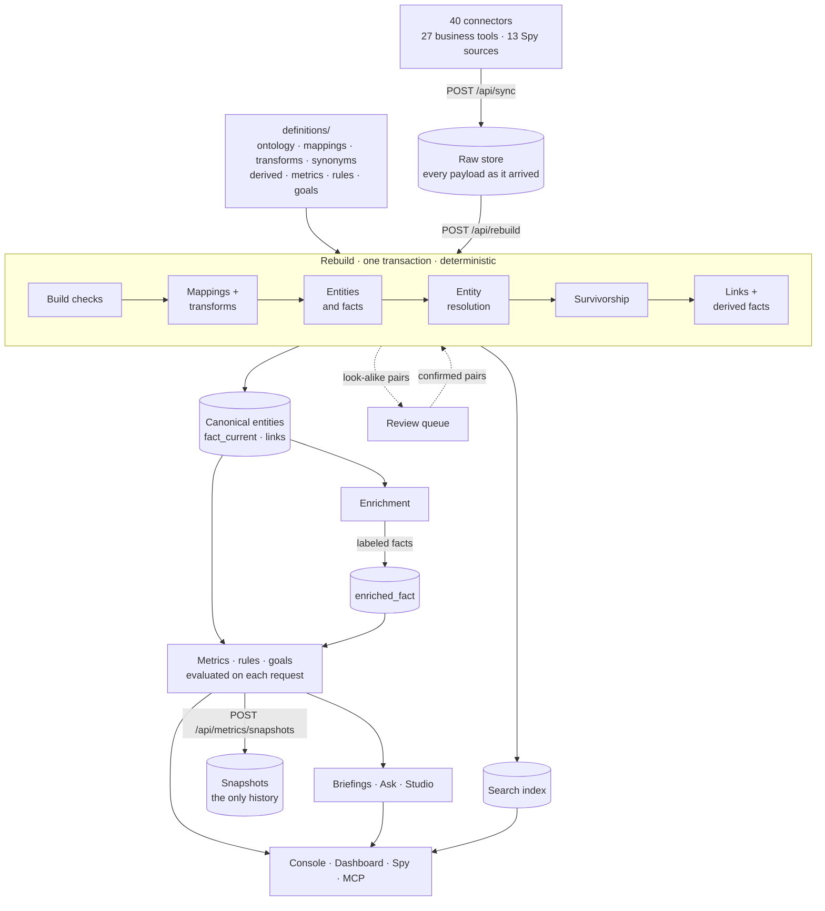
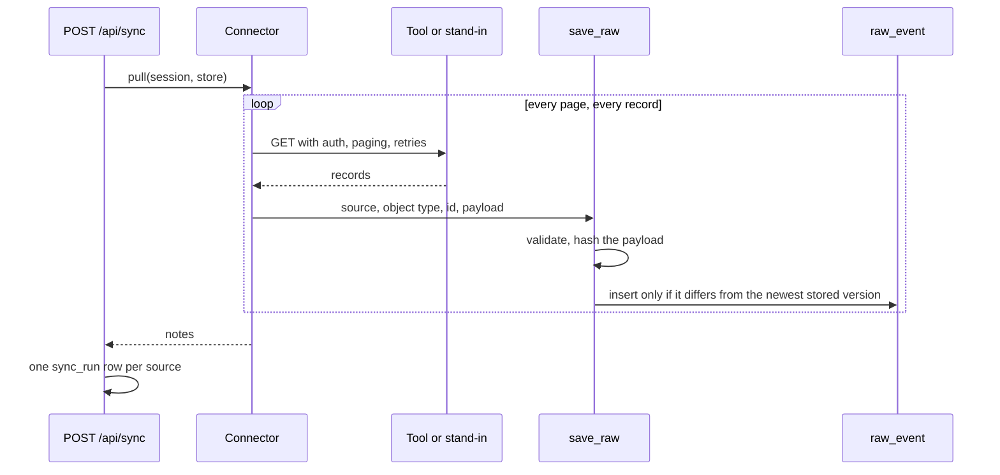
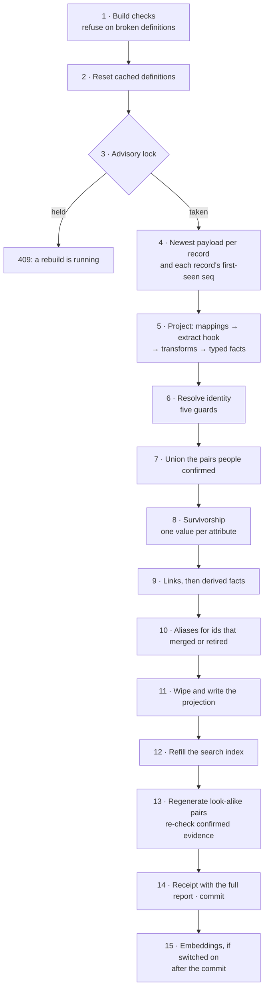
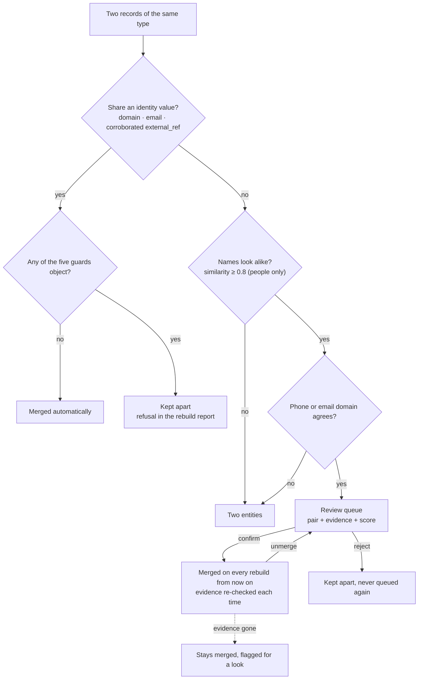

# Architecture

[DW-OS](../README.md) › Architecture

DW-OS keeps every payload its tools send exactly as it arrived, and builds everything else from those payloads with a deterministic engine steered by the [definition files](definitions.md). The same raw data and the same definitions always give the same records, the same ids and the same numbers. The AI layers sit beside the engine: they read its output and write their own tables, and the engine never depends on them.

This page follows a record from a tool to a number.

## Contents

- [The whole system](#the-whole-system)
- [Services](#services)
- [Sync and the raw store](#sync-and-the-raw-store)
- [The rebuild](#the-rebuild)
- [Entity resolution](#entity-resolution)
- [Survivorship](#survivorship)
- [Links and derived facts](#links-and-derived-facts)
- [Metrics](#metrics)
- [Rules](#rules)
- [Goals](#goals)
- [Snapshots](#snapshots)
- [Search](#search)
- [Data model](#data-model)
- [The mock world and the pinned clock](#the-mock-world-and-the-pinned-clock)
- [Limits](#limits)

## The whole system



Three details matter for everything below:

- **Metrics, rules and goals are not stored.** The rebuild stops at the canonical entities. Every number, finding and verdict is computed when an app or agent asks for it, from whatever the last rebuild wrote.
- **Nothing is scheduled.** A sync does not rebuild, a rebuild does not snapshot, and none of them run on a timer. The console has buttons for sync and rebuild; snapshots, enrichment and briefings have endpoints. The one timer in the app is the studio's marketer.
- **The AI layers write only their own tables.** A rebuild never touches enriched facts, briefings, conversations or studio assets, and none of them can change a canonical value.

## Services

`docker compose -f app/docker-compose.yml up` starts the project `os`:

| Service | What it is | Host port |
|---|---|---|
| `postgres` | Postgres 16 with pgvector and pg_trgm | 5442 |
| `backend` | FastAPI app: connectors, engine, AI layers, MCP, every route | 8092 |
| `mock` | The stand-in providers every connector talks to without keys | 8192 |
| `render` | A Chromium that turns studio HTML into PNGs | internal (8200) |
| `console` | [Console](console.md) | 3092 |
| `dashboard` | [Dashboard](dashboard.md) | 3093 |
| `spy` | [Spy](spy.md) | 3094 |
| `studio` | [Studio](studio.md) | 3095 |
| `playwright` | Screenshot suite, only under the `snap` profile | none |

The backend mounts `definitions/` live, so an edited file is read on the next rebuild without a restart. At boot it checks that every switched-on layer has its key, migrates the database to the newest Alembic revision, and runs the build checks; any failure stops it from starting.

## Sync and the raw store

A sync pulls from every enabled source, one after another in alphabetical order (`app/backend/app/sync.py`). Each source runs in its own transaction: if its pull fails, that source's rows for the run are discarded and the others keep theirs. Each attempt writes a `sync_run` row with what was fetched, written, refused and colliding, plus any truncation and the connector's own notes. Runs older than 30 days are pruned.



The raw store (`raw_event`) only ever grows:

- A payload identical to the newest stored version of the same record is not written again. A record that changes A → B → A keeps three rows.
- Every row gets a strictly increasing `seq`, which orders ingestion where timestamps from one transaction cannot.
- No code updates or deletes a raw row. Upstream deletions are not detected: a record deleted in the tool keeps projecting from its last payload.

## The rebuild

A rebuild turns the raw store into canonical entities (`app/backend/app/engine/run.py`). It wipes the derived layer and recomputes it in one database transaction, so readers see the old projection until the new one commits.



**It rewrites:** entities, their facts, canonical entities, members, aliases, `fact_current`, links, the search index, and pending review pairs.

**It never touches:** the raw store, snapshots, enriched facts, briefings, conversations, sync runs, source switches, the MCP log, studio assets, and the decisions people made in the review queue. Two small exceptions: it clears a transcript chunk's embedding when the chunk's text changes, and it re-checks the evidence on confirmed pairs.

**The receipt.** Each successful rebuild writes an `engine_run` row with its counts, duration and full report: skips, clears, dead mapping paths, quarantined identity buckets, dangling references, identity-less records, guard refusals, disagreements, skipped records and link match rates. The newest 200 are kept. A rebuild that fails writes no receipt, and a failed build check comes back as an HTTP 500 with the problems in the backend log.

**Determinism.** A canonical entity's id is a UUIDv5 of its anchor: the source, type and id of the earliest-seen record in its cluster. Records are processed in first-seen order, every tie-break is a fixed sort, and every insert is sorted, so the same raw rows produce byte-identical ids and a steady-state rebuild writes zero aliases. When a merge absorbs an entity, its old id becomes an alias of the survivor, so links and bookmarks keep working.

**Fact states.** A mapped field is in one of three states: the tool never mentioned it (no fact), the tool said it is empty (a fact with a null, counted as a clear), or it has a value. A value that fails its transform or its declared type is a named skip in the report, never a null.

## Entity resolution

Records are joined on the attributes `ontology.yaml` declares as identity: a company's `domain`, a person's `email` or `external_ref`. Every other entity type is one canonical entity per source record.



### The five guards

| Guard | Refuses | Reported as |
|---|---|---|
| Blocklist | Empty and placeholder values (`n/a`, `unknown`, `test@`, `noreply@`), and free-mail domains used as a company domain. A free-mail email still identifies a person. | `identity_blocked` |
| Bucket cap | Merging more than `ER_BUCKET_CAP` (50) records on one value; the whole bucket is quarantined | `oversized: identity_bucket` |
| Repeated within a source | A value that two records of the same tool share identifies a group or a role, not a thing, so the bucket is quarantined everywhere | `shared_across_records` |
| One record per source | A cluster holding two records from one tool (`ER_ONE_RECORD_PER_SOURCE`) | `oversized: one_record_per_source` |
| Tenant namespace | An identity scoped to one tool's account (today `person.external_ref`) joins two tools only when another identity attribute agrees for them; with no pair to check, it fails closed | `namespace_not_shared`, `namespace_unwitnessed` |

### The look-alike ladder

Only entity types that declare `candidates:` get look-alike pairs; today that is people. A pair is nominated when the names are similar (a sequence ratio of at least 0.8 on lowercased words, or the same first initial and last-name prefix) and a corroborator agrees: the phone number's digits or the email's domain, free-mail excluded. At most five pairs per record. Pairs are proposals only; nothing merges until a person confirms it in the console's review queue. See [Console → Entities](console.md#entities).

### Measured on an adversarial corpus

`mock/adversarial.py` holds 890 records across six tools with 53 planted collisions: holding companies and subsidiaries sharing a domain, near-miss legal names, agencies, shared addresses and phone lines, recycled vendor ids, 20 Smiths, shared mailboxes. Every record carries its true identity. `tests/test_adversarial_er.py` runs exact-identity resolution over it and holds these floors:

| | Precision | Recall | Floor |
|---|---|---|---|
| Companies | 1.000 (no false merges) | 0.884 | P ≥ 0.99, R ≥ 0.88, zero false merges |
| People | 0.986 | 0.930 | P ≥ 0.98, R ≥ 0.92 |

The guard against values repeated within a source took company precision from 0.922 to 1.000. The test runs in CI's unit job, where compose mounts the corpus; it skips if the corpus is missing. It measures exact identity only, not the tenant guard, the ladder or human merges.

## Survivorship

When records in one cluster disagree, one value wins per attribute:

1. The most recently changed, by the tool's own "last changed" field (`OBSERVED_AT` in the connector), falling back to ingestion time.
2. On a tie, the tool ranked higher in `source_priority` in `ontology.yaml`.
3. Still tied, a fixed order by tool name and record id, so the answer never changes between runs.

The winner records which record and raw event it came from and how many other distinct values the cluster held. If the winning value is an explicit empty, the attribute is left off the canonical entity. A cluster with no non-empty winning value is retired.

## Links and derived facts

`ontology.yaml` declares relationships, and a rebuild draws them only between entities that exist after resolution:

- A `via` link joins inside one tool: a subscription's `customer_ref` equals a company record's id in the same tool.
- A `match` link joins canonical winners on an equal attribute: a meeting is `attended_by` the person whose email matches.
- A many-to-one link that finds more than one target is quarantined, never guessed. Unresolved references are counted.

`derived.yaml` rolls values up across one link: one relationship, one aggregate (`SUM`, `COUNT` or `MAX`), an optional equality filter. The three shipped:

```yaml
company:
  mrr:
    expression: SUM(subscription.mrr)
    via: belongs_to
    filter:
      status: active
  open_tickets:
    expression: COUNT(ticket)
    via: belongs_to
    filter:
      status: open
person:
  last_meeting_at:
    expression: MAX(meeting.started_at)
    via: attended_by
```

Derived facts sit beside ordinary facts, marked as calculated, with no tool or raw record behind them. Rules and metrics can use them, which is how a rule reaches across entities: `paying_company_with_open_tickets` reads `company.mrr` and `company.open_tickets`.

## Metrics

`metrics.yaml` is the semantic layer: every number the business runs on, defined once, computed by `app/backend/app/engine/metrics.py` for every app, agent and MCP client. The shipped file holds 89 metrics.

```yaml
mrr:
  label: MRR
  description: Monthly recurring revenue on active subscriptions.
  synonyms: [revenue, run-rate]
  entity: subscription
  expression: SUM(mrr)
  filter:
    status: active

new_subscriptions_30d:
  label: New Subscriptions (30d)
  description: Subscriptions that started in the last 30 days.
  entity: subscription
  expression: COUNT(entity)
  window_days: 30
  window_attr: started_at

cost_per_conversion:
  label: Cost per Conversion
  description: Ad spend divided by ad conversions over the reporting days.
  synonyms: [cpa, cost per acquisition]
  entity: campaign_report
  op: "/"
  terms:
    - expression: SUM(spend)
    - expression: SUM(conversions)
  window_attr: report_date
```

| Part | Options |
|---|---|
| Aggregate | `COUNT(entity)`, `COUNT(attr)`, `SUM(attr)`, `AVG(attr)`; `COUNT_DISTINCT` for model-read labels only |
| Ratio | `op: /` with exactly two terms; a term may override the filter or the entity |
| Filter | `attr: value`, case-insensitive equality |
| Breakdown | `group_by` an attribute, a date with `grain` (day, week, month, quarter, year), or `entity.attr` one declared hop away |
| Window | `window_days` + `window_attr` for a fixed trailing or forward span; `window_attr` alone makes the metric rangeable by the caller |

Every result carries **receipts**: the value, how many records it counted, the population before filtering, how many values it aggregated, how many records lacked the attribute, the window, and the raw provider fields that feed it. Other rules:

- SUM of nothing is 0; AVG of nothing is unknown, because a zero average reads as a measurement.
- A sum over money in more than one currency returns no value and says why; there is no currency conversion.
- One broken metric costs only that metric: its error appears on its own row.
- A metric that counts [model-written labels](agents.md#enrichment) must say `inferred: true`, and the result carries which reading, which vocabulary and which model produced the labels it counted.

The ask agent's `slice_metric` composes one declared metric with a declared dimension, window or filter, and refuses anything else. See [MCP](mcp.md#data-read-only).

## Rules

`rules.yaml` holds what counts as worth a person's attention: conditions on one entity type, with a severity. The shipped file has 8 rules.

```yaml
stalled_deal:
  label: Deal Past Its Own Forecast Close Date
  entity: deal
  severity: high
  all:
    - {attr: status, not_equals: closed_won}
    - {attr: status, not_equals: closed_lost}
    - {attr: closed_at, older_than_days: 14}
```

Conditions combine with `all` or `any`, using 13 operators: `gt`, `gte`, `lt`, `lte`, `older_than_days`, `within_days`, `exists`, `is_null`, `equals`, `not_equals`, `contains`, `not_contains`, `starts_with`. A missing value satisfies only `exists` and `is_null`. Each finding carries the entity, its company, and the value behind each condition. Values that could not be read as a number or date are counted, so "no findings" and "could not read" stay apart.

## Goals

`goals.yaml` pairs a metric with a target a person chose and a way to judge it. The shipped file has 5 goals.

```yaml
hold_average_deal_size:
  label: Hold Average Deal Size In Band
  metric: avg_deal_size
  target: 25000
  strategy: threshold_band
  params:
    band_low: 0.8
    band_high: 1.25
```

| Strategy | Met when | Progress |
|---|---|---|
| `at_least` | current ≥ target | current ÷ target |
| `at_most` | current ≤ target | 100% under the ceiling, else target ÷ current |
| `increasing` | the snapshot series is rising (at least 2 points) and current ≥ target | as `at_least`, plus the trend |
| `threshold_band` | current is inside target × `band_low` … target × `band_high` | 100% inside; the distance outside otherwise |

A goal is **unknown**, counted apart from missed, when its metric does not exist, errors, mixes currencies, has no value, or matched no records. A real zero over records that exist is judged, so an `at_most` goal can be met by zero.

## Snapshots

Snapshots are the system's memory of its numbers. `POST /api/metrics/snapshots` evaluates every metric and writes one row each (value, records counted, and for inferred metrics the vocabulary and producer), timestamped by the database. It is the only writer: a rebuild never snapshots and neither does a page load, so history records the business, not how often someone looked. Snapshots are never deleted. Nothing calls the endpoint on a schedule yet, so history accrues only when something does.

`GET /api/metrics/history/{metric}` returns the series split into comparable runs. An inferred metric's series splits when its vocabulary or producing model changes; a trend goal refuses a series that is not comparable. An edit to a plain metric in `metrics.yaml` does not split its series, so telling a definition change from a business change means reading the file's git history beside the snapshot dates.

## Search

Each rebuild refills a word index (`search_document`, a weighted Postgres `tsvector` with a trigram index): every canonical entity's names, emails, domains and ids from every member record, other text facts, transcripts, the newest raw payload of every record, enrichment labels and quotes, and successful briefings. Definitions (metrics, rules, goals, sources, entity types, readings) are matched in memory. When no word matches, a trigram similarity pass catches typos.

With `EMBEDDINGS_ENABLED`, each rebuild also splits transcripts into chunks, and embeddings for new or changed chunks are written after the commit; a chunk keeps its vector while its text is unchanged. See [Agents → Meaning search](agents.md#meaning-search) and [Console → Search](console.md#search-and-k).

## Data model

34 tables, created by two Alembic migrations that run at boot. Every column in `app/backend/app/models.py` carries a short comment with example values.

| Group | Tables |
|---|---|
| Raw and sync | `raw_event`, `sync_run`, `source_setting` |
| Projection (rebuilt) | `entity`, `entity_fact`, `entity_canonical`, `canonical_member`, `canonical_alias`, `fact_current`, `canonical_link` |
| Engine | `engine_run`, `metric_snapshot`, `merge_candidate`, `merge_candidate_evidence` |
| Search | `search_document`, `search_chunk` (pgvector, HNSW), `embedding_run` |
| AI layers | `enriched_fact`, `enrichment_run`, `briefing_run`, `conversation_thread`, `conversation_turn`, `mcp_call` |
| Studio | `asset`, `asset_version`, `asset_file`, `asset_claim`, `asset_evidence`, `skill_run`, `skill_run_tool_call`, `agent_run`, `slot_skip`, `studio_thread`, `studio_turn` |

## The mock world and the pinned clock

Every connector works without keys because `mock/` answers for all of them: one FastAPI app mounting 32 provider stand-ins under URL prefixes that mirror the real APIs. `mock/world.py` is their shared ground truth: 10 companies, each with a scenario (Acme for entity resolution, Initech at churn risk, Stark past due, Cyberdyne with missing fields, Soylent with Bob and Robert), 22 people, subscriptions, campaigns, tickets, events, 6 sales calls with their expected labels, and the Spy corpus. `mock/docs/` holds the API contract each stand-in follows. See [Connectors](connectors.md#the-mock-world).

The app reads the time only through `app/backend/app/clock.py`, and a lint rule refuses any other clock read. Setting `CLOCK_PINNED_AT` fixes it at one instant. Unit tests, the e2e suite and the screenshot suite all pin `2026-09-04T12:00Z`, which is why every screenshot's window ends on 4 September.

## Limits

- **No scheduler** for sync, rebuild, snapshots, enrichment or briefings.
- **Full rebuilds only.** Every rebuild recomputes everything in memory (about 1.6 seconds for the 2,500 raw rows of the stand-in estate); there is no incremental path.
- **Upstream deletions are not detected.**
- **Build check messages name the definition and key, not a line**, and a failed check during a rebuild is an HTTP 500 with no receipt.
- **Equality-only filters, no currency conversion.**
- **A person's confirm skips the one-record-per-source guard**, and a rejection does not stop a later merge on exact identity.
- **Aliases reach back one rebuild.** An id absorbed by a merge resolves on the next rebuild; after another, it may not.
- **Raw immutability and permanent snapshots are conventions** in code, not database constraints.

## Related

- [Definitions](definitions.md): the files that steer every step above
- [Connectors](connectors.md): the first box in the diagram
- [Agents](agents.md): the layers beside the engine
