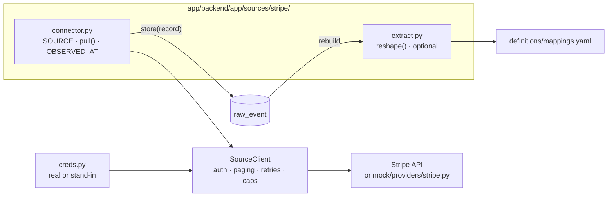

# Connectors

[DW-OS](../README.md) › Connectors

A connector brings one tool's records into the raw store. Each one knows how its provider handles sign-in, how it pages through long lists, what shape its answers come back in, and which field holds the tool's own "last changed" time. DW-OS ships 40: 27 for the tools a business runs on and 13 that watch the brand and its competitors for [Spy](spy.md).

Every connector runs against a stand-in in `mock/` when no keys are set, so the whole system works on a fresh clone. 25 of them read the real provider once their keys are set; 15 have no real-API path yet, and connecting those to a live account is work we do with you: [get in touch](../README.md#contact).

## Contents

- [Anatomy of a connector](#anatomy-of-a-connector)
- [Real API or stand-in](#real-api-or-stand-in)
- [All 40 sources](#all-40-sources)
- [How a sync behaves](#how-a-sync-behaves)
- [How they were verified](#how-they-were-verified)
- [The mock world](#the-mock-world)
- [Adding a connector](#adding-a-connector)
- [Limits](#limits)

## Anatomy of a connector

A connector is a Python package under `app/backend/app/sources/<tool>/`. The registry imports every package at startup and refuses one without a `SOURCE` name or a `pull` function, or with a duplicate name.

| Part | Does |
|---|---|
| `SOURCE` | The tool's name, as used in mapping lines and settings |
| `async def pull(session, store)` | Pages through the tool and calls `store(...)` once per record with the object type, the tool's id and the payload as it arrived. Returns notes (counters) that land in the sync's receipt. |
| `OBSERVED_AT` | For each object type, the path to the tool's own "last changed" field, such as `properties.hs_lastmodifieddate` for HubSpot. Survivorship uses it; without it, the time of the sync. |
| `ACCOUNT_CURRENCY` | For tools whose money carries no currency, the account's currency |
| `extract.py` | Optional. At rebuild, `reshape(object_type, payload)` can add fields starting with `_` (a full name, a monthly amount), split one payload into several records, or skip one with a named reason. |

The shared `SourceClient` (`sources/client.py`) does the rest:

- **Sign-in** in the style each tool uses: bearer token, basic auth, a custom header, a query token, or values in the URL.
- **Paging** with 16 paginator styles: cursors, tokens, bookmarks, offsets, Link headers, Twilio page URLs, Salesforce's SOQL chain. A response whose shape has drifted is refused.
- **Retries:** four attempts on 429 and 5xx responses with backoff; a 30-second timeout.
- **Honest truncation:** a walk stops early and says so when a cursor repeats, a page or byte cap is hit, or a request fails after some pages arrived. What it collected is kept.
- **Records without an id** are counted, never stored under a made-up key.

## Real API or stand-in

`sources/creds.py` decides, per source, at each sync:

1. `STAND_INS_ONLY=true`: the stand-in, whatever keys are set.
2. No real-API path for this source: the stand-in.
3. None of the source's variables set: the stand-in.
4. Some set and some not: refused, naming what is missing. Only that source's sync fails.
5. All set: the real API. `<SOURCE>_BASE_URL` overrides the host.

Keys shared between sources and layers have side effects worth knowing:

- `ANTHROPIC_API_KEY` switches on the AI layers' key and also sends the Claude Spy source to the real API.
- `OPENROUTER_API_KEY` sends ChatGPT, Perplexity and Gemini to the real API.
- Google Ads Transparency needs both `SERPAPI_API_KEY` and `OPENROUTER_API_KEY`; setting only the first, for Google Search, makes its sync fail as a partial set.
- The development stack reads `app/.env`, so with keys present a sync pulls real data into your local database. The screenshot suite forces stand-ins.

Every source's variables are listed in [Configuration](configuration.md#source-credentials).

## All 40 sources

| Tool | Category | What comes in (object type → entity) | Real API |
|---|---|---|---|
| HubSpot | CRM and sales | companies → company, contacts → person, deals → deal | `HUBSPOT_ACCESS_TOKEN` |
| Salesforce | CRM and sales | accounts → company, contacts → person, opportunities → deal | stand-in only |
| Calendly | CRM and sales | scheduled events → meeting | `CALENDLY_ACCESS_TOKEN`, `CALENDLY_USER_URI` |
| Zoom | CRM and sales | meetings with their transcripts → meeting | stand-in only |
| Stripe | Billing | customers → company and person, subscriptions → subscription | `STRIPE_API_KEY` |
| Shopify | Billing | orders → order, products → product | `SHOPIFY_STORE_DOMAIN`, `SHOPIFY_ACCESS_TOKEN` |
| WooCommerce | Billing | customers → person, orders → order, products → product | stand-in only |
| Zendesk | Support | organizations → company, users → person, tickets → ticket | stand-in only |
| Intercom | Support | contacts → person, conversations → ticket | `INTERCOM_ACCESS_TOKEN` |
| Mailchimp | Marketing | campaigns → email campaign, lists → audience | `MAILCHIMP_API_KEY` |
| Klaviyo | Marketing | profiles → person, flows → email campaign | `KLAVIYO_API_KEY` |
| ActiveCampaign | Marketing | contacts → person, campaigns → email campaign | `ACTIVECAMPAIGN_BASE_URL`, `ACTIVECAMPAIGN_API_KEY` |
| Customer.io | Marketing | activities → event, campaigns → email campaign, segments → audience | stand-in only |
| SendGrid | Marketing | contacts → person, single sends → email campaign | stand-in only |
| Twilio | Marketing | messages → message | `TWILIO_ACCOUNT_SID`, `TWILIO_API_KEY_SID`, `TWILIO_API_KEY_SECRET` |
| Google Ads | Advertising | campaigns → campaign, daily campaigns → campaign report | stand-in only |
| Meta Ads | Advertising | campaigns and insights → campaign, daily insights → campaign report, Facebook and Instagram posts → social post, page insights → social report | stand-in only |
| LinkedIn Ads | Advertising | ad accounts, posts → social post, follower and page stats → social report | stand-in only |
| Pinterest Ads | Advertising | ad accounts, pins → social post, account analytics → social report | stand-in only |
| Snapchat Ads | Advertising | organizations → ad account | stand-in only |
| X (Twitter) | Advertising | the account's own tweets → social post | `TWITTER_BEARER_TOKEN`, `TWITTER_USER_ID` |
| Google Analytics | Analytics | report rows → traffic report | stand-in only |
| Amplitude | Analytics | events → event | `AMPLITUDE_API_KEY`, `AMPLITUDE_SECRET_KEY` |
| Mixpanel | Analytics | events → event | `MIXPANEL_SERVICE_ACCOUNT_USERNAME`, `MIXPANEL_SERVICE_ACCOUNT_SECRET`, `MIXPANEL_PROJECT_ID` |
| Segment | Analytics | sources → data source | stand-in only |
| Smartlook | Analytics | events → event definition | stand-in only |
| Google Sheets | Other | rows → deal | stand-in only |
| Google Search | Spy | searches and AI Overviews → visibility check and mention | `SERPAPI_API_KEY` |
| ChatGPT | Spy | answers → visibility check and mention | `OPENROUTER_API_KEY` |
| Perplexity | Spy | answers → visibility check and mention | `OPENROUTER_API_KEY` |
| Gemini | Spy | answers → visibility check and mention | `OPENROUTER_API_KEY` |
| Claude | Spy | answers → visibility check and mention | `ANTHROPIC_API_KEY` |
| Google Ads Transparency | Spy | creatives and their read text → ad | `SERPAPI_API_KEY`, `OPENROUTER_API_KEY` |
| LinkedIn Ad Library | Spy | ads and ad details → ad | `SEARCHAPI_API_KEY` |
| TikTok Ads Library | Spy | ads → ad | `SEARCHAPI_API_KEY` |
| Meta Ad Library | Spy | ads → ad | `SEARCHAPI_API_KEY` |
| LinkedIn Company Posts | Spy | posts → competitor post | `BRIGHTDATA_API_KEY` |
| X Posts | Spy | posts → competitor post | `BRIGHTDATA_API_KEY` |
| Instagram Posts | Spy | posts → competitor post | `BRIGHTDATA_API_KEY` |
| TikTok Posts | Spy | posts → competitor post | `BRIGHTDATA_API_KEY` |

The category and `unlocks` text for each source live in `sources/catalog.py`, and the console lists all 40 under Config → Sources. How the Spy sources detect mentions and attribute ads and posts is on the [Spy](spy.md#sources) page.

## How a sync behaves

- `POST /api/sync` with `{}` pulls every enabled source; `{"sources": ["stripe"]}` pulls the ones named. Naming a disabled source is a 409; an unknown one is a 404.
- Sources run one after another, alphabetically. Each runs in its own transaction: a pull that raises discards that source's rows for the run and marks its sync failed; the others are unaffected.
- Each attempt writes a `sync_run` row: records fetched, written (new versions), refused (with up to five examples), and colliding (one id with two different payloads in one pull), plus pages read, truncation reasons and the connector's notes.
- A payload identical to the newest stored version is not written again, so re-syncing unchanged data adds nothing.
- Business connectors that take a date range ask for the 90 days ending on the app's clock.
- A source switched off under Config → Sources stops syncing; its raw rows still project at the next rebuild.
- A sync never rebuilds and never runs on its own; see [Architecture](architecture.md#sync-and-the-raw-store).

## How they were verified

- Each connector has a test file that replays its stand-in's saved responses (`app/backend/fixtures/mock/<tool>/`) through `pull` and checks what it stores and how it maps.
- The 12 business connectors with a real-API path were pulled from live vendor accounts and reconciled field by field. Six matched their stand-ins exactly. The Stripe, Calendly, Twilio and Mixpanel accounts were empty and the Shopify store had no orders, so those record shapes rest on the vendors' documentation.
- Each Spy stand-in was shaped from a real capture of its provider.
- Real captures are not committed, so the console reports every source as `mock-validated`. `python -m tools.pull_source <tool> --compare` compares a live pull with the stand-in on your own machine.

## The mock world

`mock/server.py` is one FastAPI app that mounts 32 provider stand-ins under URL prefixes that mirror the real APIs (`/hubspot`, `/salesforce/services/data/v67.0`, `/serpapi`, `/searchapi`, …), served on port 8192. One module can answer for several connectors: `meta.py` serves Meta Ads, Facebook and Instagram.

- **`mock/world.py`** is the ground truth every stand-in draws from: 10 companies with a scenario each (Acme tests entity resolution, Globex is healthy, Initech is at churn risk, Umbrella has churned, Wayne is new, Hooli has high MRR, Pied Piper tests email matching, Stark is past due, Cyberdyne is missing fields, Soylent has a Bob and a Robert), 22 people, subscriptions, campaigns, tickets, events, 6 sales calls with their expected labels, and the Spy corpus. Answers are pure functions of their inputs and the date, so every run is identical.
- **`mock/docs/`** holds 32 API contracts, one per provider, which the stand-ins follow.
- **Auth is permissive but checked:** any non-empty token passes, and the auth mechanism must be the one the real API uses.
- **`mock/adversarial.py`** is the entity-resolution corpus; see [Architecture](architecture.md#measured-on-an-adversarial-corpus).

## Adding a connector

1. Create `app/backend/app/sources/<tool>/connector.py` with `SOURCE`, `pull`, and `OBSERVED_AT` for each object type.
2. Add `extract.py` if records need fields built or split before mapping.
3. Add the tool's lines to `definitions/mappings.yaml`, and any new attributes, relationships or `source_priority` entry to `ontology.yaml`.
4. Register its credentials in `sources/creds.py`: a stand-in entry always, and a real entry with its variables when it can reach the real API.
5. Add its label, category and `unlocks` text to `sources/catalog.py`.
6. Write the stand-in in `mock/providers/<tool>.py`, mount it in `mock/server.py`, and write its contract in `mock/docs/`.
7. Save sample responses under `app/backend/fixtures/mock/<tool>/` with the expected result, and add its test file.
8. Run `./test.sh unit`: the build checks refuse a mapping line for an unknown tool, an attribute no line fills, and a money field with no currency.

## Limits

- **Deletions are not detected.** A record deleted in the tool keeps projecting from its last payload.
- **Caps are per walk.** `CONNECTOR_MAX_PAGES` and `CONNECTOR_MAX_BYTES` apply to one paginated request chain, not to a whole pull.
- **Five tools declare no "last changed" field** (Google Sheets, Google Analytics, Google Ads, Mailchimp, Salesforce) and X declares none, so their survivorship falls back to when the sync ran.
- **No webhooks.** Every connector pulls; nothing arrives between syncs.
- **The X connector is listed under Advertising** but pulls the account's own organic tweets.

## Related

- [Architecture](architecture.md): what happens to raw records at rebuild
- [Definitions](definitions.md#mappingsyaml): mapping lines
- [Configuration](configuration.md#source-credentials): every source's variables
