# Console

[DW-OS](../README.md) › Console

The console is the operator's app. From it a person syncs the tools, rebuilds the data, decides which records are the same customer, reads what the last rebuild did, and checks what each definition file says. It is the only app that writes to the pipeline. The [dashboard](dashboard.md) and [Spy](spy.md) only read, and the [studio](studio.md) writes content, not data.

It also shows the parts other apps hide: raw payloads exactly as a tool sent them, the records behind each canonical entity, the field each value won from, every metric's receipts, and the report of every rebuild.


| | |
|---|---|
| Address | http://localhost:3092 |
| For | Whoever operates DW-OS |
| Code | `app/console/` (React), routes in `app/backend/app/api/` |
| Writes | Sync, source switches, rebuild, review decisions, briefings |
| Compose service | `console`, port 3092 → 3000 |

## Contents

- [How it connects](#how-it-connects)
- [Pages](#pages)
- [What each action does](#what-each-action-does)
- [API it calls](#api-it-calls)
- [Code](#code)
- [Tests](#tests)
- [Limits](#limits)

## How it connects

The console runs as a Vite server in its own container and forwards `/api` and `/mcp` to the backend. Every number it shows comes from the backend, which reads Postgres. Nothing is computed in the browser.

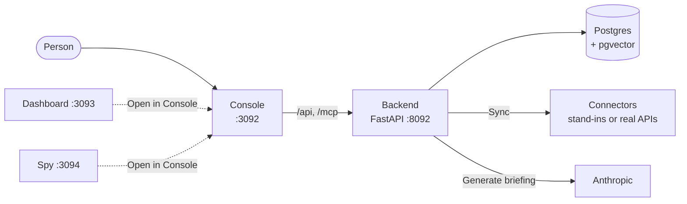

The dashboard and Spy link into the console: an empty page links to Config → Sources, and a metric's "Open in Console" opens its row under Definitions → Metrics.

## Pages

| Page | Address | What it answers |
|---|---|---|
| [Home](#home) | `/` | Are we hitting our targets, and what needs attention now? |
| [Activity](#activity) | `/activity` | What changed most recently, and in which tool? |
| [Metrics](#metrics) | `/metrics?metric=<name>` | What is each number, what was counted, and how has it moved? |
| [Entities](#entities) | `/entities/{canonical,raw,visualize,review}` | Who is this customer across every tool? Which records might be the same? |
| [AI](#ai) | `/ai/{enrichment,coaching}` | What did the model read out of the transcripts? What did each briefing say? |
| [Definitions](#definitions) | `/definitions/<file>` | What do the definition files say? |
| [Config](#config) | `/config/{sources,rebuild,mcp}` | Which tools are on, when did they sync, and what did the last rebuild do? |
| [Search](#search-and-k) | `/search?q=` | Where does this name, email, id or phrase appear? |

Every tab has its own address, so any view can be linked, and the browser's back button walks tab history. Every column header carries an ⓘ hint of ten words or fewer, and a Playwright spec fails the build if one is missing.

### Home

The heading reads "Insights". Two cards:

- **Goals:** every goal in `goals.yaml` with its metric, target, current value, verdict (met, missed or unknown), progress bar, and detail chips such as the band or the trend direction.
- **Findings:** every record that trips a rule in `rules.yaml`, sorted by severity, with the rule, the entity, its company, and the evidence values that tripped it.

Both are computed when the page asks, against the current canonical data. Neither is stored.

### Activity

The newest fact changes, grouped so one row is one record changing in one tool at one time, with the changed values as `attr=value` chips. Filters narrow by entity type and by source. It looks at the newest 500 fact rows.

### Metrics

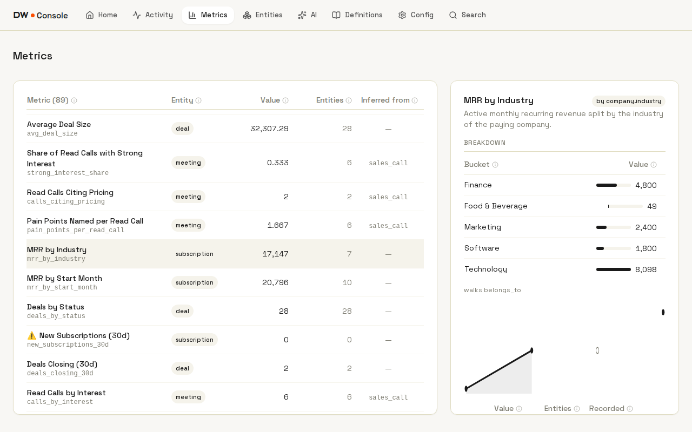

The left table lists every metric in `metrics.yaml` (89 in the shipped file) with its value, how many records it counted, and, for metrics that read model-written labels, the reading they are inferred from. A ⚠️ flags a metric with an error, mixed currencies or a note.

Selecting one shows:

- its description and how it is sliced (`by company.industry`, `30d trailing`)
- a breakdown with bars, plus footnotes such as the relationship it walked or how many records had no value
- a sparkline and table over its [snapshot](architecture.md#snapshots) series
- the receipts: the full JSON of what was counted, from which raw fields, and how many records were missing the field

### Entities

Four tabs.

**Canonical** lists one row per real-world thing after [entity resolution](architecture.md#entity-resolution). Selecting one shows the source records that make it up and the evidence that joined each one, every fact with the source that won it, when it was observed and how many sources disagreed, and its links to other entities. A raw event id opens the payload that value came from.

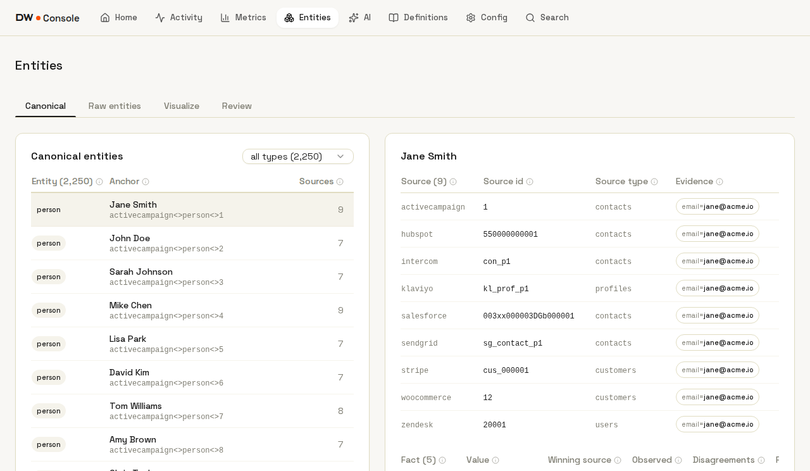

**Raw entities** lists one row per source record, with its facts and every payload the tool sent for it, shown exactly as delivered before any mapping or merge.

**Visualize** draws each company or person with its linked records on a ring around it.

**Review** is the review queue. A rebuild puts a pair here when two records' names look alike and a second attribute agrees (see the [resolution ladder](architecture.md#entity-resolution)). Each row shows both records, the evidence, a score from 0 to 1, and its status.

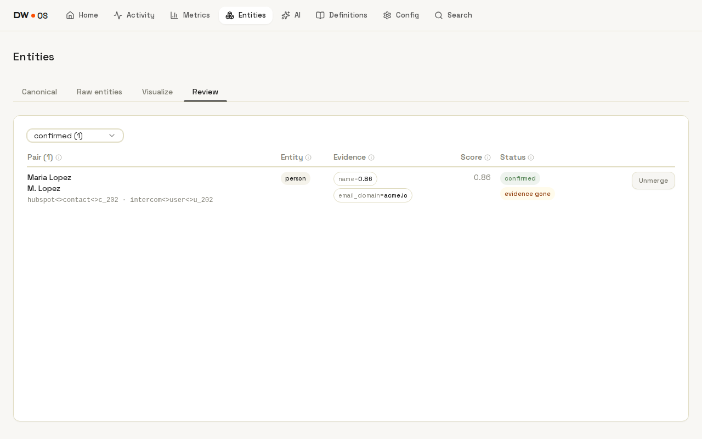

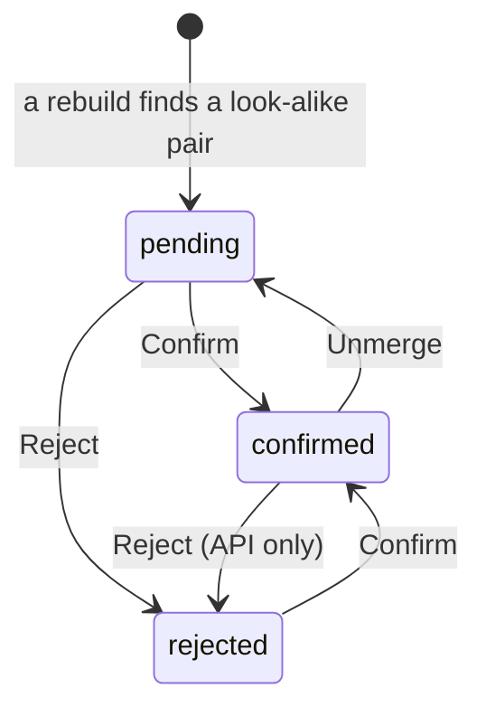

Every decision runs a full rebuild in the same request, so the canonical entities reflect it at once. Confirmed pairs survive rebuilds, and rejected pairs are never queued again. When a confirmed pair's two records stop sharing any evidence, the row gets an "evidence gone" pill and stays merged until a person looks. A decision made while another rebuild is running gets a 409 and changes nothing.

### AI

Two tabs, one per model-backed layer that stores what it writes. A layer that is switched off is faded and inert, with "disabled · switched off in settings" beside the heading.

- **Enrichment** lists the labeled facts the model wrote from transcripts: record, fact, value, whether its quote was found word for word in the source text, and the quote. Filters narrow by entity, fact, value and unverified quotes. Enrichment runs only through `POST /api/enrichment/run`; the console has no button for it.
- **Coaching** lists every briefing written for a role (CEO and head of sales ship), newest first, with its text, the recipients named in the brief's front matter, and what it read: how many metrics, goals and findings, which model, which prompt version. **Generate** writes a new one. Recipients are shown only; nothing is sent to them.

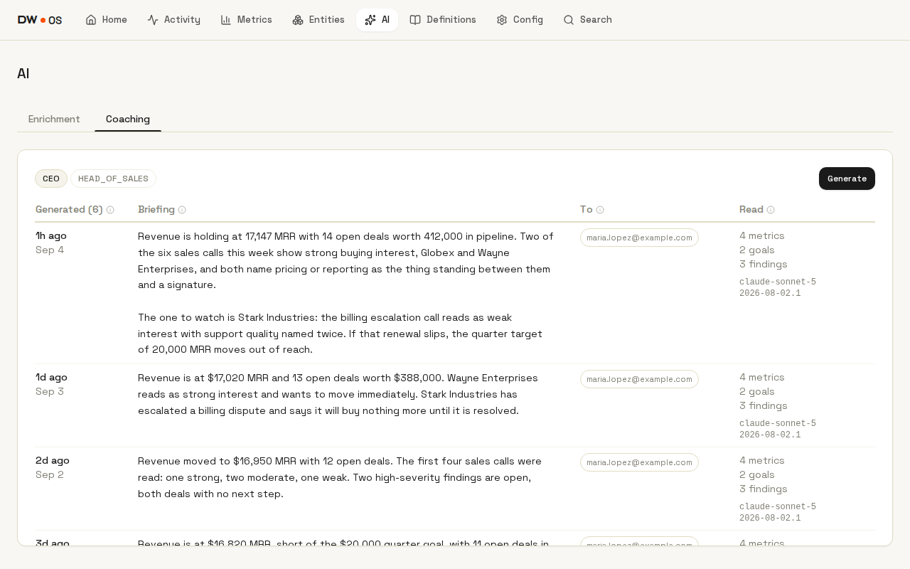

The ask agent has no page: it answers at `POST /api/conversation`, and outside assistants get its tools through [MCP](mcp.md). See [Agents](agents.md) for all three layers.

### Definitions

The definition files as tables, one tab each: ontology, mappings, transforms, metrics, derived, rules, goals, enrichment, dashboards, and spy. It is read-only; a change is an edit to the file and a rebuild (see [Definitions](definitions.md)). Deep links open one row, such as `/definitions/metrics?metric=mrr` or `/definitions/rules?rule=revenue_at_risk`.

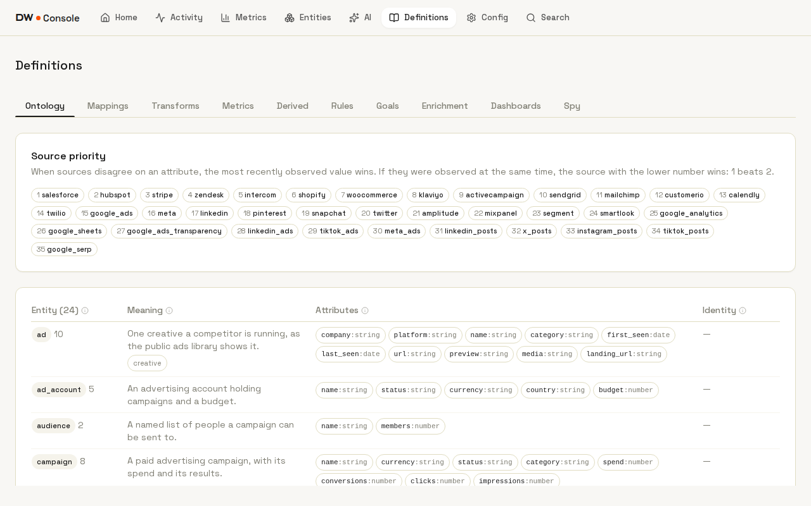

`synonyms.yaml`, `calendar.yaml`, `prompts.yaml`, the briefs, the brand files and the looks are not shown here.

### Config

**Sources** lists every source (40 in the catalog) with the record types it fills, its last sync and whether it succeeded, what the last sync in this session wrote, and an Enabled switch. **Sync** pulls one source, **Sync all** pulls every enabled one, and **Rebuild** rebuilds. A sync does not rebuild on its own; the person presses Rebuild after it.

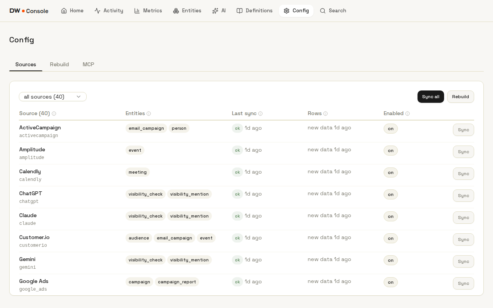

**Rebuild** lists past rebuilds, newest first, beside the receipt of the one selected: how long it took, how many raw events, entities and facts, ten counters (skips, clears, oversized, candidates, dead paths, quarantines, dangling references, disagreements, identity-less records, records skipped), a table for each non-empty problem class, and the full report as JSON.

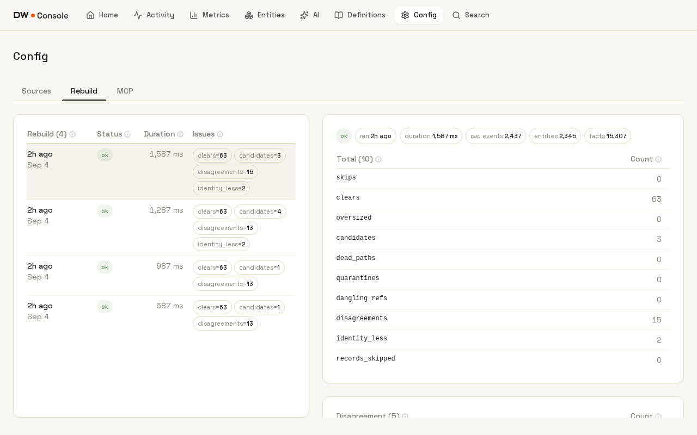

**MCP** shows the endpoint with a Copy button, every tool, resource and prompt the MCP server offers, and ready-made client config for Claude Code, Claude Desktop and Cursor. See [MCP](mcp.md).

### Search and ⌘K

One search box over everything stored: names, emails, ids, statuses, transcript passages, briefings and the definitions. A prefix narrows the kind (`person:wayne`, `briefing:revenue`), and a trigram fallback catches typos, so "acme corpp" finds Acme Corp. When meaning search is switched on, chips switch between words, meaning, and both.

⌘K (or Ctrl+K) opens the same search from any page. Under two characters it shows the last five searches and a "Go to" list of every page and tab; from two characters it shows results grouped by kind.

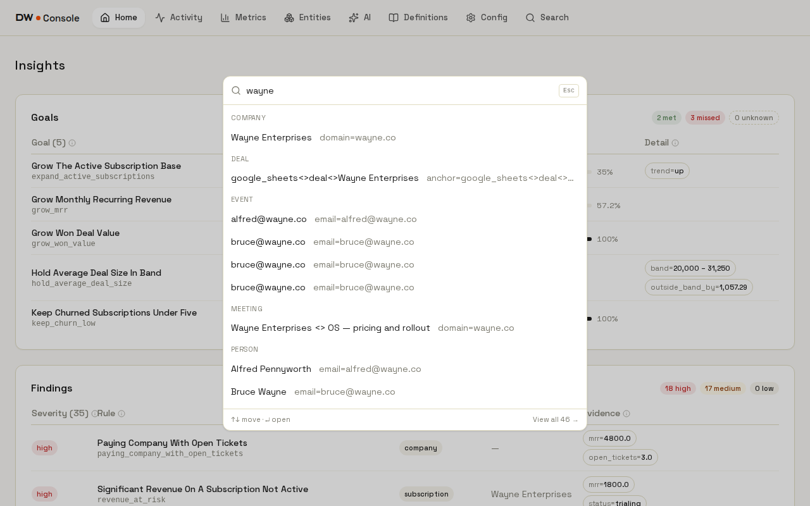

A result opens the thing it found, with the row selected:

| Kind | Opens |
|---|---|
| raw event | Entities → Raw entities |
| metric | Metrics |
| rule, goal, entity type, reading | its tab under Definitions |
| source | Config → Sources |
| briefing | AI → Coaching, scrolled to that briefing |
| company, person, deal and every other entity | Entities → Canonical |

The backend and the console each keep one list of kinds, paths and parameter names (`app/backend/app/search_vocab.py` and `app/console/src/search/vocab.ts`), and `./test.sh unit` fails if the two drift.

## What each action does

The console has five buttons that change state. None of them runs on a schedule.

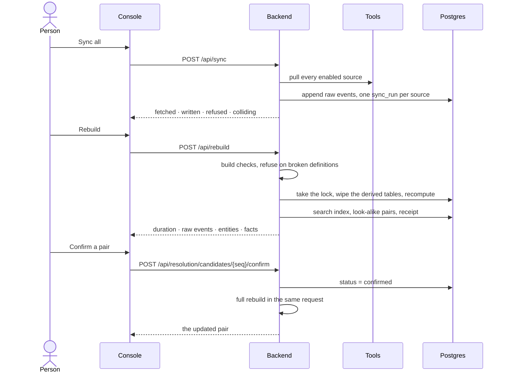

| Action | Where | Request | What changes |
|---|---|---|---|
| Sync | Config → Sources | `POST /api/sync` with `{"sources": [...]}` or `{}` for all | Raw events appended; a disabled source gets a 409 |
| Enable or disable a source | Config → Sources | `PUT /api/sources/{source}/enabled` | The stored switch; Sync all skips disabled sources |
| Rebuild | Config → Sources | `POST /api/rebuild` | Every derived table; a second rebuild at the same time gets a 409 |
| Confirm, reject, unmerge | Entities → Review | `POST /api/resolution/candidates/{seq}/{action}` | The pair's status, then a full rebuild |
| Generate a briefing | AI → Coaching | `POST /api/coaching/{role}` | One model call, one stored briefing; a 409 when the layer is off |

## API it calls

All reads are `GET`. Routers are registered in `app/backend/app/api/routers.py`.

| Page | Endpoints |
|---|---|
| Home | `/api/insights/goals`, `/api/insights/rules` |
| Activity | `/api/activity?limit=500` |
| Metrics | `/api/metrics`, `/api/metrics/history/{metric}` |
| Entities | `/api/entities`, `/api/entities/{id}`, `/api/records`, `/api/raw`, `/api/raw/{id}`, `/api/graph`, `/api/resolution/candidates` |
| AI | `/api/enrichment/vocabulary`, `/api/enrichment`, `/api/coaching`, `/api/coaching/{role}/history` |
| Definitions | `/api/definitions/{ontology,mappings,transforms,metrics,derived,rules,goals,dashboards,spy}` |
| Config | `/api/sources`, `/api/report/runs`, `/api/report/runs/{seq}`, `/api/mcp` |
| Search | `/api/search?q=&kind=&mode=&limit=&offset=` |

The backend has endpoints the console never calls: metric snapshots (`POST /api/metrics/snapshots`), enrichment runs (`POST /api/enrichment/run`), the ask agent (`/api/conversation`), and everything the dashboard, Spy and studio use.

## Code

React 18, TypeScript, Vite 6, Tailwind and shadcn/ui on Radix primitives, with self-hosted Space Grotesk and Science Gothic fonts.

```
app/console/src/
  routes.tsx       pages, tabs and nav order
  paths.ts         paths and tab ids, importable by the Playwright specs
  api.ts           fetch wrapper, ApiError, shared types
  components/      Layout (shell and intro), TopNav, CommandPalette, SectionCard, Filter
  components/ui/   table (with hints), tooltip, pill, banner, pager, loading
  lib/             useGet, useTab, useScrollTo, hrefFor, format
  search/vocab.ts  the search vocabulary, mirrored from the backend
  views/           Insights, Activity, Metrics, Entities, AI, Definitions, Config, Search
```

Every list uses one layout: one card per table, the row count in the first column header, filters with per-option counts in the card title, and a sticky header. At desktop width the page itself never scrolls, except Home. A full page load plays a short intro, about 3.5 seconds, that collapses "Digital Workers" into "DW"; it is skipped when the system asks for reduced motion.

## Tests

The console has no unit tests. It is covered by 12 Playwright specs under `app/e2e/` with 98 committed screenshots, compared pixel for pixel.

`./test.sh snap` starts a separate compose project with every source on its stand-in, every model layer off, and the clock pinned at `2026-09-04T12:00Z`. It syncs, rebuilds twice, seeds briefings, labels and snapshots, then runs the suite. CI runs it on every pull request. Any change under `app/console/` ships with its updated baselines (`./test.sh snap-update`).

## Limits

- **No authentication.** Anyone who reaches port 3092 or 8092 can sync, rebuild, decide merges and start paid model calls. Run it on localhost or behind your own network boundary (see `SECURITY.md`). Review decisions record when, not who.
- **Nothing is scheduled.** Sync and rebuild are buttons. Metric snapshots and enrichment runs have no button at all; history accrues only when something calls their endpoints.
- **A failed rebuild leaves no receipt.** Only successful rebuilds are recorded, so the Rebuild tab never shows a failure.
- **Lists are capped.** Canonical and raw lists load the first 500 records, Activity reads the newest 500 facts, and the Rebuild tab lists 50 runs.
- **The ask agent has no page.**
- **Development server.** Compose serves the Vite dev server; there is no production bundle yet.

## Related

- [Architecture](architecture.md): what a sync and a rebuild do underneath these buttons
- [Definitions](definitions.md): the files the Definitions page shows
- [Agents](agents.md): enrichment, briefings and the ask agent
- [Configuration](configuration.md): the settings that switch layers on
