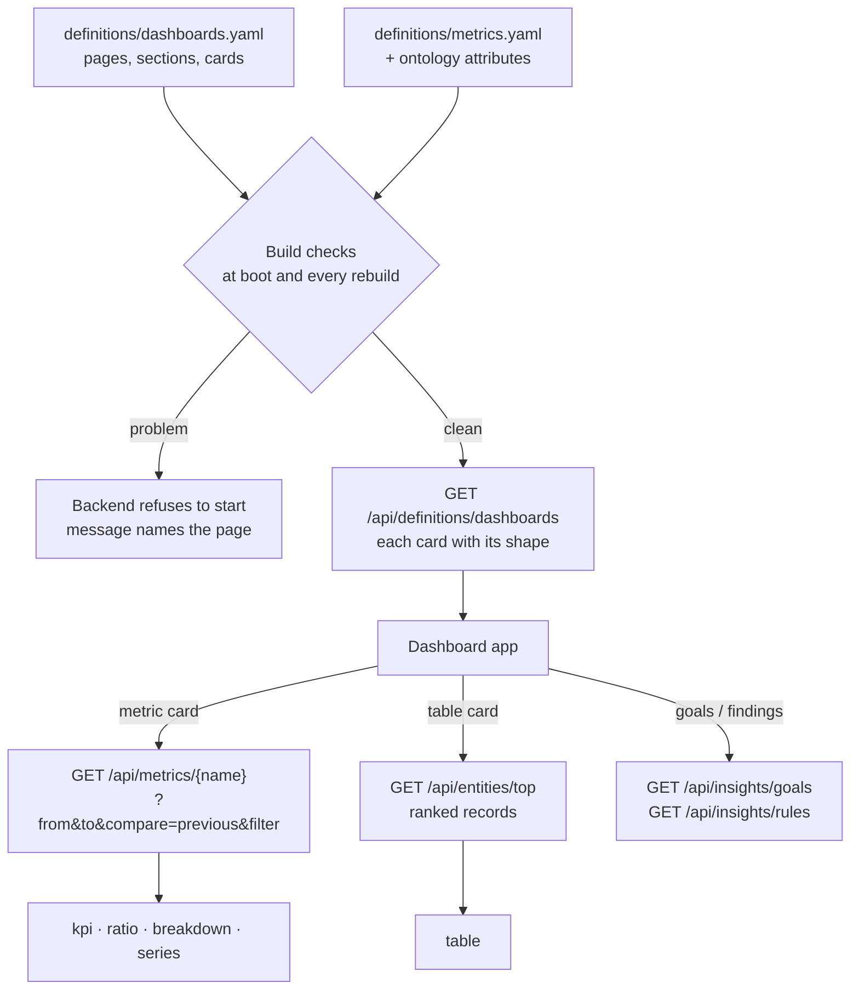
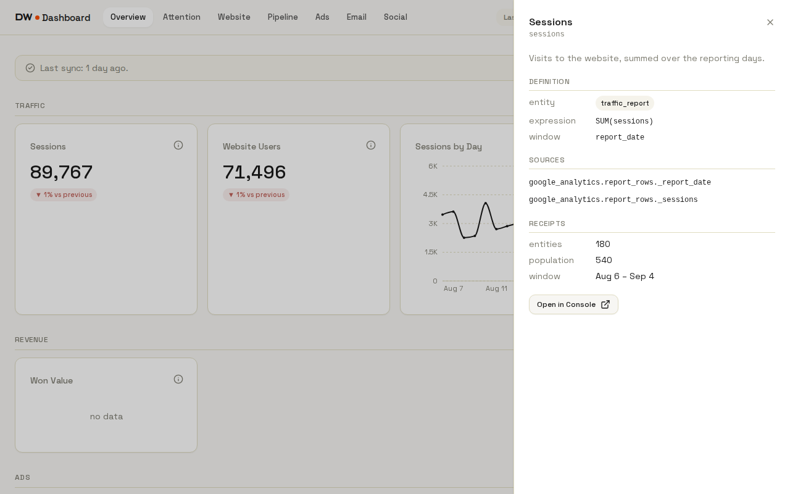
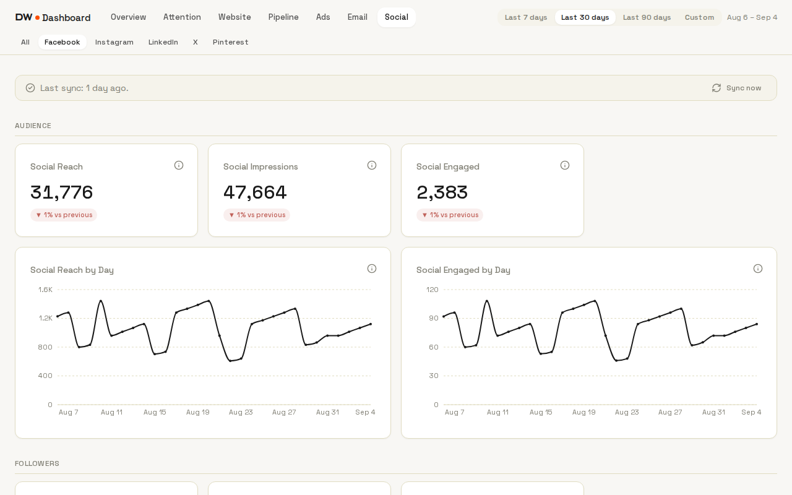
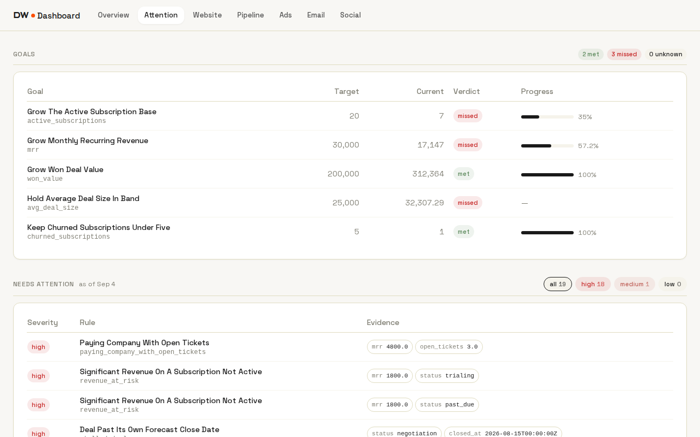

# Dashboard

[DW-OS](../README.md) › Dashboard

The dashboard is for whoever runs the business. It shows the pages `definitions/dashboards.yaml` declares, over a date range the reader picks, each number compared with the period before. It only reads: nothing on it can sync, rebuild or write history, so opening it a hundred times changes nothing.

Every metric card is a metric from `metrics.yaml`, calculated by the backend with the same code the [console](console.md) and the [agents](agents.md) use. The dashboard adds the page's date range and filter to the request, and draws the result. It can be installed as an app on a phone or a desktop.


| | |
|---|---|
| Address | http://localhost:3093 |
| For | Whoever runs the business |
| Code | `app/dashboard/` (React), `app/backend/app/engine/dashboards.py` |
| Declared in | `definitions/dashboards.yaml` |
| Writes | Nothing |
| Compose service | `dashboard`, port 3093 → 3000 |

## Contents

- [How a card gets its number](#how-a-card-gets-its-number)
- [Pages as shipped](#pages-as-shipped)
- [dashboards.yaml](#dashboardsyaml)
- [Date ranges and "vs previous"](#date-ranges-and-vs-previous)
- [Attention: goals and findings](#attention-goals-and-findings)
- [Installing it](#installing-it)
- [API it calls](#api-it-calls)
- [Code and tests](#code-and-tests)
- [Limits](#limits)

## How a card gets its number

The YAML never says how to draw a card. A card names a metric, and the backend works out its shape from the metric's definition. The dashboard asks for each card separately, with the page's range and filter, and picks the component that matches the shape.



| Metric declares | Shape | Drawn as |
|---|---|---|
| `group_by` and `grain` | series | A line over time |
| `group_by` only | breakdown | Bars, the top 8 shown and the rest behind "N more" |
| two terms and an `op` | ratio | A figure with two decimals |
| anything else | kpi | A figure |

Each card's ⓘ opens a drawer with the metric's description, its definition (entity, expression, filter, window), the raw fields it reads, the receipts for this request (records counted, population, window, bad dates, currencies), and an "Open in Console" link.



The dashboard and the console call the same calculation code with different inputs. The console's Metrics page asks for every metric over all data; a ranged dashboard card asks for its window and filter. So Sessions on the console and Sessions for the last 30 days on the dashboard can show different numbers, and both are correct.

## Pages as shipped

The shipped file declares 14 pages: 7 in the top nav and 7 sub-tabs under Ads and Social. Together they hold 151 cards over 63 of the 89 metrics.

| Page | Address | Range | Filter | What is on it |
|---|---|---|---|---|
| Overview | `/overview` | yes | | Sessions, users, sessions by day, won value, ad spend and conversions, emails sent, open rate, posts, likes |
| Attention | `/attention` | no | | Goals and findings, no cards (see [below](#attention-goals-and-findings)) |
| Website | `/website` | yes | | Sessions and users with daily series, sessions by channel |
| Pipeline | `/pipeline` | no | | Deal count, won value, average deal size, deals by status, MRR, active and churned subscriptions, MRR by industry |
| Ads | `/ads` | yes | | Spend, conversions, cost per conversion, clicks, impressions, spend by campaign and by platform |
| Google Ads | `/ads/google_ads` | yes | `platform: google` | Spend, results, CTR, CPC, conversion value, ROAS, campaigns |
| Meta Ads | `/ads/meta_ads` | yes | `platform: meta` | The same, plus landing page views |
| Email | `/email` | yes | | Emails sent, campaigns, sends by day, opens, clicks, open and click rates |
| Social | `/social` | yes | | Posts, likes, comments, shares, posts and likes by platform |
| Facebook | `/social/facebook` | yes | `platform: facebook` | Audience, followers, posts, engagement, post types, top posts by reach and by likes |
| Instagram | `/social/instagram` | yes | `platform: instagram` | The same families, with saves and views; two tables |
| LinkedIn | `/social/linkedin` | yes | `platform: linkedin` | Followers, posts, engagement, post types; two tables |
| X | `/social/x` | yes | `platform: x` | Posts, engagement; top posts by likes |
| Pinterest | `/social/pinterest` | yes | `platform: pinterest` | Audience, pins, pin types; top pins by saves |

Each network page shows only the cards its source fills: X has no daily account series, LinkedIn has no reach, and Pinterest has no likes. One set of social metrics serves all five networks through the page filter.



Every page has a committed screenshot at `app/e2e/__screenshots__/dashboard/pages.spec.ts/dashboard-<page>.png`, with `_` in the page key written as `-`.

## dashboards.yaml

The top level maps a page key to a page, and the nav follows file order. A trimmed excerpt of the shipped file:

```yaml
overview:
  label: Overview
  range: true
  sections:
    - label: Traffic
      cards: [sessions, users, sessions_by_day]
    - label: Email
      cards: [emails_sent, open_rate]
attention:
  label: Attention
  goals: true
  findings: true
facebook:
  label: Facebook
  parent: social
  range: true
  filter:
    platform: facebook
  sections:
    - label: Audience
      cards: [social_reach, social_impressions, social_engaged, social_reach_by_day]
    - label: Top posts
      cards:
        - table: social_post
          label: Top Posts by Reach
          rank: reach
          columns: [name, category, posted_at, reach, interactions]
          window_attr: posted_at
          limit: 10
```

| Page key | Meaning |
|---|---|
| `label` | Tab text. Required. |
| `parent` | Makes the page a sub-tab of another top-level page, at `/<parent>/<key>`. One level only. |
| `range` | `true` gives the page the range picker and windows every card, with "vs previous". |
| `filter` | `attr: value` pairs added to every card on the page. A key in the request beats the same key fixed in a metric. |
| `goals`, `findings` | `true` shows the goals table and the findings list above the sections. |
| `sections` | Titled groups of cards. Required unless `goals` or `findings` is set. |

A card is either a metric name, or a table: `table` (the entity type), `label`, `rank` (a numeric attribute to sort on), `columns`, an optional `window_attr` (a date attribute), `limit` (1 to 50, default 10) and an optional `filter`.

### What the checks refuse

The file is checked at boot and before every rebuild, with the other [definition files](definitions.md#build-checks). A problem stops the backend from starting, and the message names the page. The main checks:

- A card names no metric in `metrics.yaml`.
- A metric appears twice on one page.
- A metric on a ranged page has no date to range over. A metric can be ranged when it declares `window_attr` without `window_days`: 69 of the 89 shipped metrics can.
- A page filter names an attribute the card's entity does not have.
- A `parent` names itself, names no page, or has a parent of its own.
- A table ranks an undeclared entity, ranks on an attribute that is not a number, lists a column the entity does not have, or sits on a ranged page with no date `window_attr`.
- Unknown keys, wrong types, and a `limit` outside 1 to 50.

The checks live in `app/backend/app/engine/dashboards.py`, and the shipped file is tested against the shipped metrics on every pull request. The console lists the cards under Definitions → Dashboards.

## Date ranges and "vs previous"

- Presets are Last 7, 30 and 90 days, plus Custom with two date inputs. The default is 30 days.
- "Today" is the backend's clock, as a UTC date, so the browser's clock and time zone play no part. The snapshot suite pins it at 4 September 2026, which is why the screenshots read "Aug 6 – Sep 4".
- Ranges include both ends: the last 30 days on 4 September is 6 August to 4 September.
- A record counts when the date in its `window_attr` falls inside the range. Values that are not dates are left out and counted as bad dates in the receipts.
- "vs previous" compares with the window of the same length ending the day before: 6 August to 4 September is compared with 7 July to 5 August. The pill shows ▲ or ▼ and the percentage; hovering shows the previous window.
- Pages without `range` (Pipeline, Attention) evaluate over all data and hide the picker.
- The range is shared by every page and resets on reload.

## Attention: goals and findings



The Attention page shows what the console's home page shows, for readers:

- **Goals:** met, missed and unknown counts, then each goal's target, current value, verdict and progress. The judging rules are in [Architecture](architecture.md#goals).
- **Needs attention:** every finding the rules produce, "as of" the moment it was computed, sorted by severity, filterable by severity, with the evidence values.

Both describe the present, so they ignore the range picker. Neither links to the record.

## Installing it

The dashboard is a progressive web app with a manifest, icons and a hand-written service worker.

- The service worker caches the app's files (HTML, scripts, styles, fonts) and never caches anything under `/api`. Numbers always come from the backend.
- Offline, the cached app opens and shows "cannot reach the backend" in place of the pages.
- Installing on Android or desktop Chrome, and the offline cache, need HTTPS or `localhost`. Compose serves plain HTTP, so a phone reaching the machine by its network address needs an HTTPS proxy in front. iOS "Add to Home Screen" works without one.

## API it calls

Every request is a `GET` through the app's `/api` proxy, one request per card.

| Endpoint | Used for |
|---|---|
| `/api/definitions/dashboards` | The pages, their cards and each card's shape |
| `/api/metrics/{name}?from=&to=&compare=previous&filter=attr:value` | One metric card, with the previous window |
| `/api/entities/top?entity=&rank=&columns=&limit=` | One table card; records missing the rank sort last |
| `/api/definitions/metrics` | The definition drawer |
| `/api/insights/goals`, `/api/insights/rules` | The Attention page |

## Code and tests

React 18, TypeScript, Vite 6, Tailwind, TanStack Query and Recharts, with the console's neutral colours and fonts.

```
app/dashboard/
  public/          manifest.json, sw.js, icons, fonts
  src/App.tsx      page list, "today", range state, routes
  src/api.ts       types and the six GET helpers
  src/views/       Page: one page, its queries, its grid
  src/cards/       MetricCard, Kpi, Ratio, Figure, Breakdown, Series, TableCard
  src/components/  Layout, TopNav, RangePicker, Goals, Findings, Definition, EmptyPage
```

Nine Playwright specs cover it with 22 committed screenshots. Most specs read `/api/definitions/dashboards` when they run, so they follow the YAML: add a page and the page walk visits it. The backend side (`tests/test_dashboards.py`, the metric range tests) is held to 100% line and branch coverage.

## Limits

- **No authentication.** The dashboard's `/api` proxy forwards every backend route, writes included, and port 3093 is published on every interface. Keep it on localhost or a private network.
- **Units are not formatted.** Money prints as a plain number and ratios as decimals, so a 5% click-through rate shows as `0.05`.
- **Colour ignores direction.** Up is green and down is red, even for cost per conversion, where down is good.
- **The range is not in the address**, so a range cannot be shared as a link.
- **Series are not zero-filled.** A day with no records is missing from the line.
- **No MCP resource.** An assistant can read `metrics.yaml` over [MCP](mcp.md) but not `dashboards.yaml`.
- **Development server.** Compose serves the Vite dev server; there is no production bundle yet.

## Related

- [Definitions](definitions.md): `metrics.yaml` and the other files a card depends on
- [Architecture](architecture.md#metrics): how a metric is calculated
- [Console](console.md): the same numbers with their receipts, for the operator
