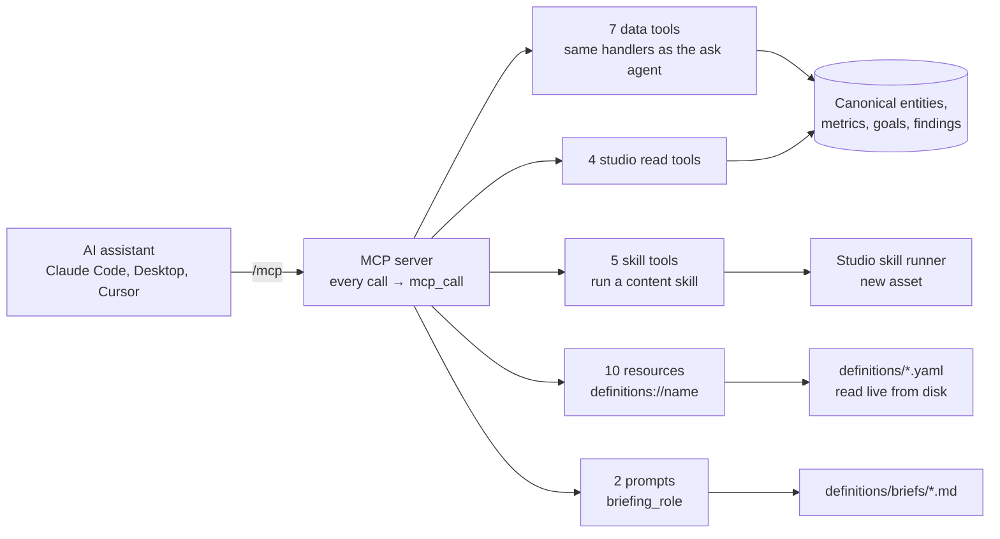

# MCP

[DW-OS](../README.md) › MCP

DW-OS runs a [Model Context Protocol](https://modelcontextprotocol.io) server at `/mcp`. Any AI assistant that speaks MCP, such as Claude Code, Claude Desktop or Cursor, can use it as a tool. The assistant gets the same reviewed numbers, definitions and briefing prompts the console shows. Asked about revenue, it reports the number DW-OS agreed on, and it can read `metrics.yaml` to check what that number means before quoting it.

The data tools are the ask agent's own tools, registered from the same list, so what an outside assistant can do and what the built-in [ask agent](agents.md#ask) can do cannot drift apart. They call no model and work with every AI switch off. Every call is logged.

| | |
|---|---|
| Endpoint | `http://localhost:3092/mcp` (through the console) or `http://localhost:8092/mcp` (the backend) |
| Transport | Streamable HTTP |
| Code | `app/backend/app/mcp.py` (FastMCP) |
| Call log | the `mcp_call` table |
| Offers | 16 tools, 10 resources, 2 prompts |

## Connect

```bash
claude mcp add --transport http os http://localhost:3092/mcp
```

For Claude Desktop, Cursor and other clients that take JSON:

```json
{"mcpServers": {"os": {"type": "http", "url": "http://localhost:3092/mcp"}}}
```

The console's Config → MCP page shows the endpoint, the live list of tools, resources and prompts, and both snippets with a Copy button.

## How it fits



## Tools

### Data (read-only)

| Tool | Arguments | Returns |
|---|---|---|
| `get_metrics` | none, `entity`, or `name` | With no argument, every metric with its value. With `entity`, that entity's metrics with descriptions. With `name`, one metric's receipts, breakdown and the raw provider fields that feed it. |
| `slice_metric` | `metric`, plus `group_by` and `grain`, or `window_days` with `window_attr` and `window_direction`, or `filter_attr` with `filter_value` | One metric composed with a declared dimension, a window, or one equality filter. With only `metric`, it lists what the metric can be sliced by. It refuses anything the definitions do not declare. |
| `get_goals` | none | Every goal with its current value, target and verdict: met, missed or unknown |
| `get_findings` | none | Every finding the rules produce, with the entity, its company and the facts that fired it |
| `entity_counts` | none | How many canonical entities of each type exist, with the glossary |
| `find_entities` | `entity_type`, optional exact `name`, `limit` (up to 50) | Canonical entities of a type, optionally matching one exact value such as a company name or an email |
| `get_entity` | `canonical_id` | One entity: every value, the source that won it, when it was observed, how many sources disagreed, and the raw event behind it |

None of these accept a query language. Every argument is a scalar checked against the definitions, and every handler only reads. A metric that reads model-written labels comes back marked `inferred`.

A question like "what is MRR by industry?" becomes one call:

```json
{"tool": "slice_metric", "arguments": {"metric": "mrr", "group_by": "company.industry"}}
```

### Studio

| Tool | Read-only | Does |
|---|---|---|
| `assets_list` | yes | List assets by kind, look, origin or name |
| `assets_read` | yes | One asset with its versions, files, claims, evidence and feedback |
| `brand_read` | yes | One brand file; pass the full file name, such as `voice.md` |
| `looks_read` | yes | One look's manifest, sample and layouts |
| `dw_linkedin_post`, `dw_newsletter`, `dw_blog`, `dw_image`, `dw_carousel` | no | Run that content skill with `ask`, and optionally `look` and `ratio`. The call returns when the asset is built, with its files and status. |

The skill tools are the only tools that change anything: each one lands a new asset in the [studio](studio.md) library, with `mcp` as its origin. They need `STUDIO_ENABLED`, and they are generated from the skills folder, so a new content skill becomes a new tool.

## Resources

`definitions://<name>` returns a definition file as YAML, read from disk on each request: `ontology`, `mappings`, `transforms`, `synonyms`, `metrics`, `rules`, `goals`, `enrichment`, `derived` and `spy`. See [Definitions](definitions.md) for what each file decides.

`dashboards.yaml`, `calendar.yaml`, `prompts.yaml` and the briefs are not resources. The brand files and looks are reachable through the studio read tools.

## Prompts

One prompt per briefing role, named `briefing_<role>`: `briefing_ceo` and `briefing_head_of_sales` ship. Each is the brief's plain-English body, without its front matter. An assistant can pair a prompt with `get_metrics`, `get_goals` and `get_findings` to write a briefing the way the [briefing layer](agents.md#briefings) does. Prompts are registered when the backend starts, so a new brief appears after a restart.

## The call log

Every tool call, resource read and prompt request writes one `mcp_call` row: the kind, the name, the arguments, whether it succeeded, how long it took, and the error if any. Listing requests are not logged. No page shows the log yet; the nightly [operator](agents.md#operator) reads it for errors and for the tools assistants reach for.

## Limits

- **No authentication.** Anyone who reaches the port can call every tool, including the skill tools, which start paid model runs. Compose publishes the backend on every interface, so keep it on localhost or behind your own network boundary (see `SECURITY.md`).
- **No actor on the log.** A call records what was asked, not who asked.
- **Search is not a tool.** An assistant finds records with `find_entities` by exact value, not by words or meaning.
- **Skill tools block** until the run finishes, which can take minutes.

## Related

- [Agents](agents.md): the ask agent that shares these tools
- [Definitions](definitions.md): the files the resources serve
- [Studio](studio.md): what the skill tools make
