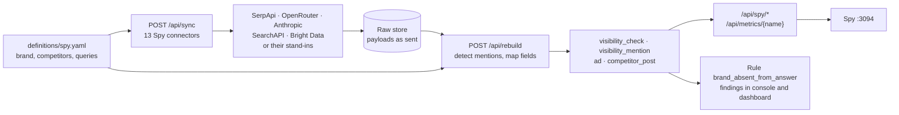
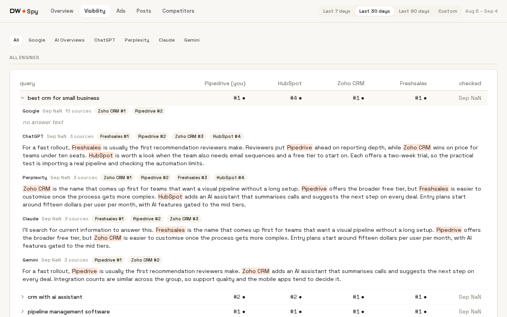
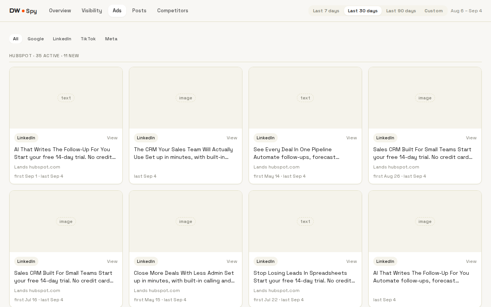
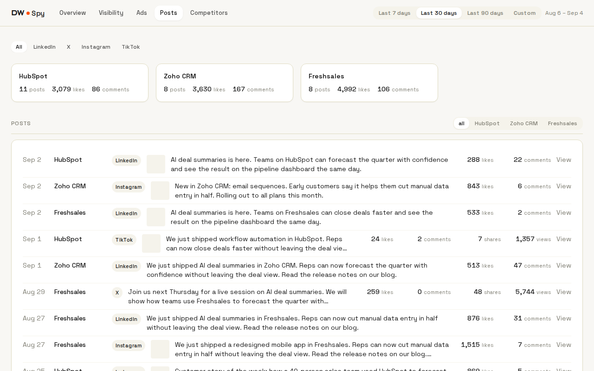
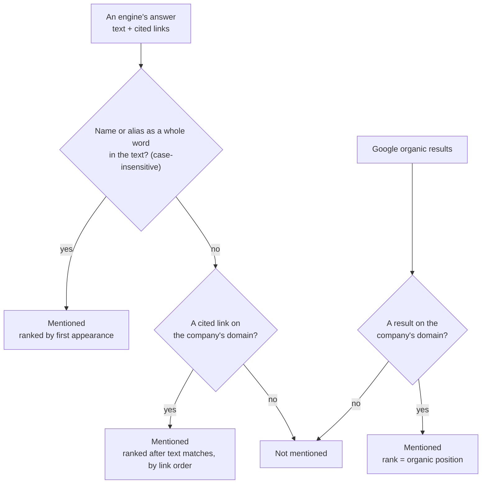

# Spy

[DW-OS](../README.md) › Spy

Spy is for whoever looks after the brand. It does two jobs:

- **Visibility:** for a fixed list of queries, how the brand and each competitor come up in Google results, Google AI Overviews, ChatGPT, Perplexity, Claude and Gemini.
- **Competitor watch:** what each competitor is running in the Google, LinkedIn, TikTok and Meta ad libraries, and what it posts on its LinkedIn page, X, Instagram and TikTok.

What Spy tracks is one file, `definitions/spy.yaml`. The data arrives through 13 of the 40 connectors, goes through the same sync and rebuild as everything else, and lands as records and metrics that the console, the dashboard and [MCP](mcp.md) can read too. Spy itself only reads.


| | |
|---|---|
| Address | http://localhost:3094 |
| For | Whoever looks after the brand |
| Code | `app/spy/` (React), `app/backend/app/api/spy_api.py`, `app/backend/app/engine/spy.py` |
| Declared in | `definitions/spy.yaml` |
| Writes | Nothing |
| Compose service | `spy`, port 3094 → 3000 |

## Contents

- [How Spy data flows](#how-spy-data-flows)
- [Pages](#pages)
- [How a mention is detected](#how-a-mention-is-detected)
- [spy.yaml](#spyyaml)
- [Sources](#sources)
- [Running it on real data](#running-it-on-real-data)
- [API it calls](#api-it-calls)
- [Code and tests](#code-and-tests)
- [Limits](#limits)

## How Spy data flows



Every Spy record is one of four entity types:

| Entity | One per | Key facts |
|---|---|---|
| `visibility_check` | engine × query × day | engine, query, checked_at, answer text, number of sources, brand rank |
| `visibility_mention` | company found in a check | company, role (brand or competitor), rank |
| `ad` | creative in an ad library | company, platform, name (the ad's text), category, first and last seen, preview, media, landing URL |
| `competitor_post` | post on a competitor's profile | company, platform, text, category, posted_at, likes, comments, shares and views where the network gives them, preview |

Mentions are detected during the rebuild, not during the sync. Editing a name, alias or domain in `spy.yaml` and rebuilding re-scores every check already collected. New queries and competitors are pulled by the next sync after that rebuild.

## Pages

Five pages. Every page except Competitors takes a date range (Last 7, 30 or 90 days, or Custom), and "today" is the backend's clock.

| Page | Address | Tabs |
|---|---|---|
| Overview | `/overview` | |
| Visibility | `/visibility/:engine` | All, Google, AI Overviews, ChatGPT, Perplexity, Claude, Gemini |
| Ads | `/ads/:platform` | All, Google, LinkedIn, TikTok, Meta |
| Posts | `/posts/:platform` | All, LinkedIn, X, Instagram, TikTok |
| Competitors | `/competitors` | |

### Overview

Four metric cards, each with a "vs previous" pill over the window of the same length before:

| Card | Metric in `metrics.yaml` | Calculation |
|---|---|---|
| Brand mention rate | `brand_mention_rate` | Brand mentions ÷ checks in the window, shown as a fraction (0.64) |
| AI Overview mentions | `ai_overview_brand_mentions` | Brand mentions in Google AI Overviews |
| Google position | `brand_google_position` | Average organic rank on Google, over checks where the brand ranked |
| Competitor ads | `competitor_ads` | Ads seen in the window, all platforms |

Below them:

- **Share of voice by engine:** one row per company, brand first, one column per engine. Each cell is the share of that engine's checks in the window that mention the company.
- **Brand mentions by day:** the daily brand mention rate, as a percentage.
- **Latest competitor activity:** the five newest ads and five newest posts, merged newest first, each linking out.

### Visibility

One row per tracked query, one column per company. A cell shows the company's best rank across the engines' latest checks for that query, and the last column says when it was checked. On an engine tab, the cell is that engine's rank.

Expanding a row shows each engine's latest answer, with every company name and alias marked, the number of sources it cited, and the rank of each company it named. Google organic results carry no answer text.



### Ads

One section per competitor with ads in the window, headed "N active · M new": active ads were last seen in the window, new ones were also first seen in it. Each card has the creative's preview, the platform, a ▶ link when the ad has a video, the ad's text, the host a click lands on where the library gives it, first and last seen dates, and a link to the ad in its library.



### Posts

Summary cards per competitor (posts, total likes, total comments) for the platform and window, a company filter, then the posts newest first, 20 to a page: date, company, platform, thumbnail, text, likes, comments, and shares and views on X and TikTok.



### Competitors

`spy.yaml` as a page: the brand with its domain, aliases, country and language; a table of competitors with every handle and advertiser id; the tracked queries; and each Spy source with its on or off state. The console shows the same file under Definitions → Spy.

## How a mention is detected

Detection is deterministic and runs in `app/backend/app/engine/spy.py`. No model judges whether a company was mentioned.



- A company is checked by its name and every alias; subdomains of its domain count, `www.` is ignored.
- On AI engines the rank is the order of first mention. On Google it is the organic position, and titles and snippets are not scanned.
- What counts as a cited source differs per engine: URL citations for ChatGPT, Perplexity and Gemini (with Gemini's redirect links replaced by the domain in their title), citations plus every page read by the web search tool for Claude, and the reference links for AI Overviews.
- Each answer's text and the number of sources are stored. The cited URLs themselves are used for detection and then dropped.

## spy.yaml

A trimmed excerpt of the shipped file, which names real companies (Pipedrive against HubSpot, Zoho CRM and Freshsales) so the stand-ins have something to find:

```yaml
brand:
  name: Pipedrive
  domain: pipedrive.com
  aliases: []
competitors:
  - name: HubSpot
    domain: hubspot.com
    aliases: [HubSpot CRM]
    linkedin: hubspot
    x: HubSpot
    instagram: hubspot
    tiktok: hubspot
    google_advertiser_id: AR10072600183532683265
    tiktok_advertiser_id: "6948549846680732417"
    tiktok_advertiser_name: "HUBSPOT, INC."
    meta_page_id: "6039999393"
  - name: Zoho CRM
    domain: zoho.com
    aliases: [Zoho]
    linkedin: zoho
    x: Zoho
    instagram: zoho
    google_advertiser_id: AR07034216898162065409
    meta_page_id: "231460215383"
queries:
  - best crm for small business
  - hubspot alternatives
country: US
language: en
```

| Key | Rule | Used by |
|---|---|---|
| `brand.name`, `brand.domain`, `brand.aliases` | Name required; domain is a lowercase host with no scheme or path | Mention detection |
| `competitors[].name`, `domain`, `aliases` | Same rules; no name, alias or domain may repeat across the file | Mention detection, LinkedIn Ad Library search |
| `linkedin` | Company page slug | LinkedIn Company Posts |
| `x`, `instagram`, `tiktok` | Handle without `@` | X, Instagram and TikTok Posts |
| `google_advertiser_id` | `AR` followed by digits | Google Ads Transparency |
| `tiktok_advertiser_id` + `tiktok_advertiser_name` | Digits plus the library's own spelling; always together | TikTok Ads Library |
| `meta_page_id` | Digits | Meta Ad Library |
| `queries` | Non-empty strings; no two may reduce to the same slug | Every visibility source |
| `country` | Two uppercase letters | Google, the three ad libraries on SearchAPI |
| `language` | Two lowercase letters | Google |

Numeric ids must be quoted, because the checks accept strings only. The six engines are fixed in code; to stop tracking one, switch its source off under Config → Sources. A competitor without a handle or id is skipped by the source that needs it, and the sync records a note saying so. The brand's own ads and posts are not fetched.

The file is checked at boot and before every rebuild, like every [definition file](definitions.md#build-checks). An edit takes effect at the next rebuild.

## Sources

| Source | Provider | Keys | Each sync pulls |
|---|---|---|---|
| Google Search | SerpApi | `SERPAPI_API_KEY` | One search per query, plus the AI Overview when Google returns one |
| ChatGPT | OpenRouter (`openai/gpt-5.6-luna` with web search) | `OPENROUTER_API_KEY` | One answer per query |
| Perplexity | OpenRouter (`perplexity/sonar`) | `OPENROUTER_API_KEY` | One answer per query |
| Gemini | OpenRouter (`google/gemini-3.5-flash-lite` with web search) | `OPENROUTER_API_KEY` | One answer per query |
| Claude | Anthropic (`claude-haiku-4-5` with web search, up to 3 searches) | `ANTHROPIC_API_KEY` | One answer per query |
| Google Ads Transparency | SerpApi, then OpenRouter reads each image ad's text | `SERPAPI_API_KEY`, `OPENROUTER_API_KEY` | Up to 2 pages of 40 creatives per advertiser; up to 50 new text reads |
| LinkedIn Ad Library | SearchAPI | `SEARCHAPI_API_KEY` | Up to 2 pages per competitor name, then up to 50 new ad details |
| TikTok Ads Library | SearchAPI | `SEARCHAPI_API_KEY` | Up to 4 pages per advertiser id and name |
| Meta Ad Library | SearchAPI | `SEARCHAPI_API_KEY` | Up to 2 pages per page id |
| LinkedIn Company Posts | Bright Data | `BRIGHTDATA_API_KEY` | Up to 50 posts per company page |
| X Posts | Bright Data | `BRIGHTDATA_API_KEY` | Up to 50 posts per profile |
| Instagram Posts | Bright Data | `BRIGHTDATA_API_KEY` | Up to 50 posts per profile; reels, images and carousels |
| TikTok Posts | Bright Data | `BRIGHTDATA_API_KEY` | Up to 50 posts per profile, with plays and shares |

Queries go to the AI engines as typed, with no system prompt, country or persona. The ad-reading prompt lives in `definitions/prompts.yaml` (`ad_reader`), and its version is stored on each reading.

Some library behaviour shaped the connectors:

- The LinkedIn library also returns ads employees run under their own names, so an ad is kept only when its advertiser is one of the competitor's names or aliases.
- LinkedIn publishes run dates and landing pages only for ads delivered in the EU, so an ad's last-seen date is the day the connector saw it.
- The TikTok library refuses an advertiser id alone and matches a bare name against other advertisers' text, so id and name travel together.
- Posts are attributed by the profile they were discovered on, so an Instagram collab post counts for the competitor Spy asked about.

Each source has its own package under `app/backend/app/sources/`, with a `connector.py` that pulls and an `extract.py` that reshapes. The Bright Data trigger, poll and download loop is shared in `sources/brightdata.py`, and the SearchAPI paging in `sources/searchapi.py`. See [Connectors](connectors.md) for how every connector works.

## Running it on real data

With no keys, every source answers from a stand-in in `mock/`, and every page renders. The stand-ins know the four shipped companies and are dated around 4 September 2026; they do not read `spy.yaml`, so edits to it change nothing until real keys are set.

A source reads its real API once every key it names is set. Things to know before setting them:

- **Nothing syncs on its own.** Share of voice and daily series need a sync every day, from the console or `curl -X POST localhost:8092/api/sync`.
- **One sample per engine per query per day.** A second sync on the same day replaces the first. Model answers vary between runs.
- **Volume.** A sync with the shipped file sends 8 searches to Google, 32 questions to the four AI engines, up to 50 image reads, and about 30 SerpApi searches in all; SerpApi's free plan (250 a month) lasts about 8 days of daily syncs.
- **Time.** Syncs run one source after another. Bright Data collects posts asynchronously, and a sync waits up to 5 minutes for X and LinkedIn, 10 for Instagram and 15 for TikTok.
- **Spend is not tracked** inside DW-OS. OpenRouter's cost lands only in the raw payloads.

## API it calls

| Method and path | Returns |
|---|---|
| `GET /api/spy/visibility?engine=&from=&to=` | Companies, check count, the latest check per engine per query with its mentions and answer, and share of voice per company and engine |
| `GET /api/spy/ads?platform=&from=&to=` | Ads newest first, with active and new counts per company |
| `GET /api/spy/posts?platform=&company=&from=&to=&limit=&offset=` | A page of posts, the total, and posts, likes and comments per company |
| `GET /api/metrics/{name}?from=&to=&compare=previous` | The Overview cards and the daily series |
| `GET /api/definitions/spy` | `spy.yaml` as parsed, plus the fixed engine list |
| `GET /api/sources` | The Spy sources and their switches, for the Competitors page |

Twelve Spy metrics are defined in `metrics.yaml`, and the rule `brand_absent_from_answer` in `rules.yaml` turns a check that omits the brand into a finding on the console home page and the dashboard's Attention page.

## Code and tests

React 18, TypeScript, Vite 6, Tailwind, TanStack Query and Recharts, in the console's colours and fonts.

```
app/spy/src/
  App.tsx          routes, the shared range, "today"
  api.ts           typed client: metrics, definition, visibility, ads, posts, sources
  lib/engines.ts   engines and platforms, with their labels
  views/           Overview, Visibility, Ads, Posts, Competitors
  components/      ShareTable, MentionMatrix, ActivityList, MetricInfo, SubNav, RangePicker
  cards/           MetricCard, Figure, Series, AdCard, PostRow, CompanySummary
```

The backend side has a test file per source that replays the stand-in's responses, plus tests for `spy.yaml`'s rules, detection, and the three Spy routes, all under the 100% coverage gate. Six Playwright specs cover the app with 11 committed screenshots.

## Limits

- **No authentication** on the app or `/api/spy/*`.
- **Detection matches words, not meaning.** A brand whose name is a common word will be over-counted; spelling variants need aliases. Rank is order of appearance, with no sentiment.
- **Cited sites are counted, not listed.**
- **Preview links expire.** TikTok, Meta and Instagram serve previews and videos from signed links, and Spy does not archive the files.
- **`/api/spy/ads` is not paged**, and an unknown `platform` returns nothing rather than an error.

## Related

- [Connectors](connectors.md): how the 13 Spy sources fit the connector contract
- [Definitions](definitions.md): `spy.yaml` among the other files
- [Configuration](configuration.md#source-credentials): every source's keys
