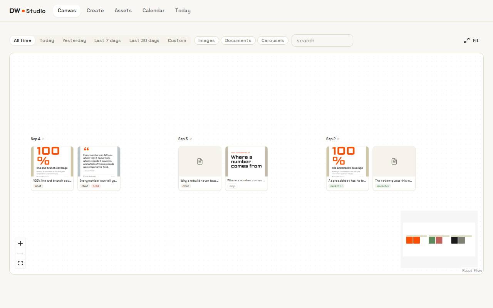
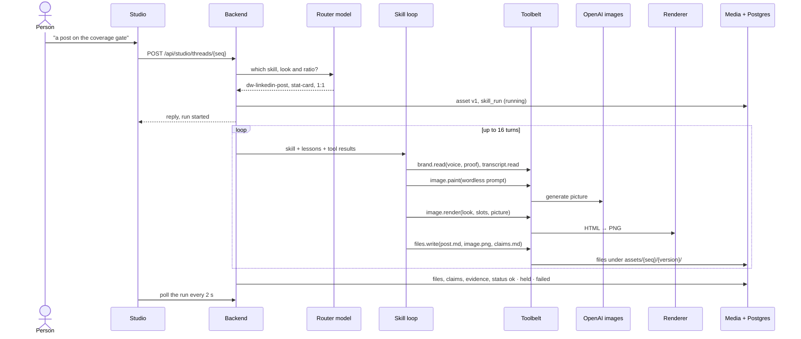
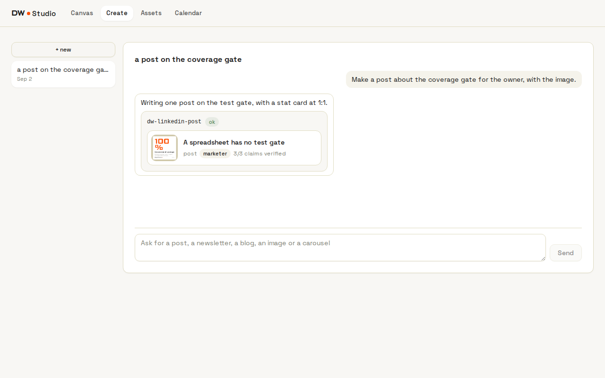
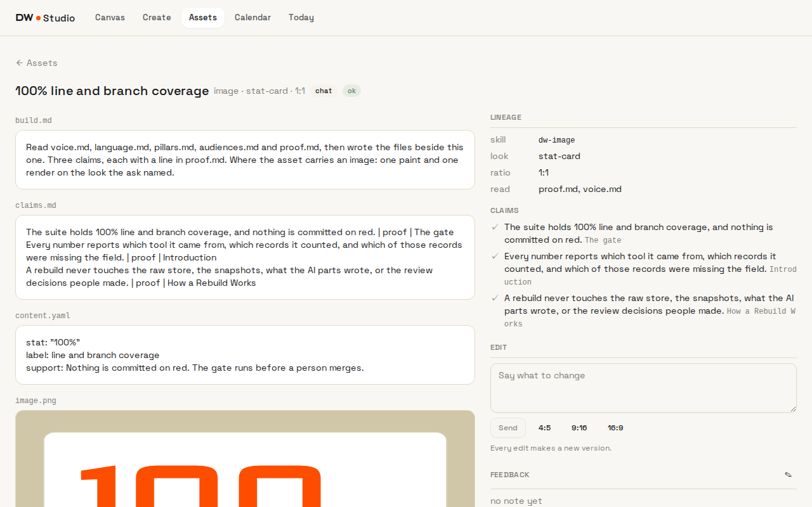
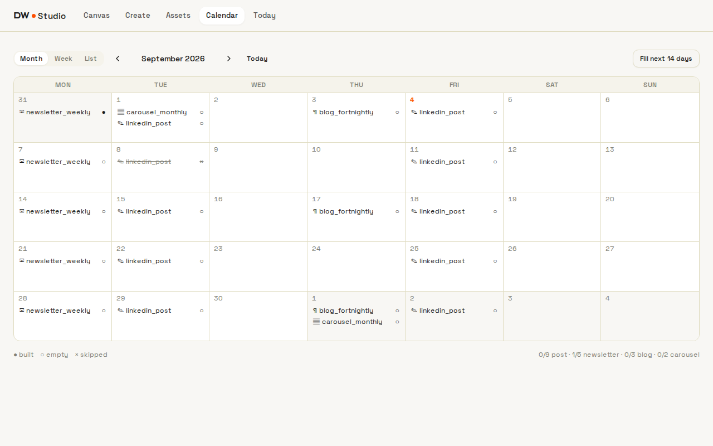
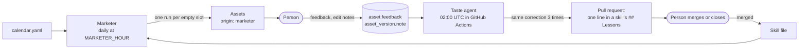

# Studio

[DW-OS](../README.md) › Studio

The studio is for whoever markets the business. It holds everything the company has made (posts, newsletters, blog posts, images and carousels) and makes more on request, on a calendar, or when an AI assistant asks over [MCP](mcp.md).

Every piece is made by a content skill: a plain Markdown file under `.claude/skills/` that says what to read, the steps to take and the rules to keep. A skill reads the brand files your company owns, takes every number from `proof.md`, quotes customers word for word from call transcripts, and writes down each claim with the line it came from. A run that cannot source what it needs stops and says what was missing. Nothing publishes: an asset leaves the studio as files a person downloads.



| | |
|---|---|
| Address | http://localhost:3095 |
| For | Whoever markets the business |
| Code | `app/studio/` (React), `app/renderer/`, `app/backend/app/{skills,studio,render,agents}/` |
| Skills | `.claude/skills/dw-linkedin-post`, `dw-newsletter`, `dw-blog`, `dw-image`, `dw-carousel` |
| Declared in | `definitions/brand/`, `definitions/looks/`, `definitions/calendar.yaml` |
| Writes | Assets: files under `MEDIA_DIR` and their rows in Postgres |
| Switch | `STUDIO_ENABLED`, which needs `ANTHROPIC_API_KEY` and `OPENAI_API_KEY` |
| Compose services | `studio` (port 3095 → 3000) and `render` (internal, port 8200) |

## Contents

- [How a piece gets made](#how-a-piece-gets-made)
- [Pages](#pages)
- [The content skills](#the-content-skills)
- [Claims, evidence and held runs](#claims-evidence-and-held-runs)
- [Pictures and cards](#pictures-and-cards)
- [Brand, looks and calendar](#brand-looks-and-calendar)
- [The marketer and the taste agent](#the-marketer-and-the-taste-agent)
- [MCP tools](#mcp-tools)
- [Storage and API](#storage-and-api)
- [Code and tests](#code-and-tests)
- [Limits](#limits)

## How a piece gets made

A request reaches a skill from one of four places: the Create chat, the calendar, an asset's Edit box, or an MCP tool. The backend then runs the skill as an agent loop: the model reads the skill's instructions and calls a fixed set of tools, up to 16 turns. The asset is exactly the files the skill wrote through `files.write`; nothing the model says on the way is kept.



1. **Route.** In the Create chat, a first model call (`studio_router` in `definitions/prompts.yaml`) picks the skill, the look and the ratio, and refuses a skill, look or ratio that does not exist. The calendar, the Edit box and MCP name the skill directly.
2. **Open.** The backend creates the asset (or its next version), and a `skill_run` row recording the skill's SHA-256, so an asset can be traced to the exact skill file, lessons included, that made it.
3. **Loop.** The system prompt is the safety rules, the whole skill file, the lessons in force, and today's date. Tool results come back fenced as data and capped at 16,000 characters.
4. **Finish.** Every written file becomes an asset file; each line of `claims.md` becomes a claim; every file the skill read becomes evidence. The run ends `ok`, `held` or `failed`, and a failed run keeps the files it wrote.

The skill has no shell, network or database access. Its only tools:

| Tool | Does |
|---|---|
| `brand.list`, `brand.read`, `brand.assets` | List and read the seven brand files; list the logo and fonts |
| `calendar.read` | Read the calendar's slots |
| `looks.read` | Read a look's slots, sample and layouts |
| `assets.read` | Read an earlier asset; on an edit, the version before this one |
| `transcript.read` | List meetings, or read one meeting's transcript |
| `image.paint` | Paint a picture with no words in it |
| `image.render`, `carousel.render` | Put the words on a look over the picture; render each carousel page |
| `files.write` | Write one file of the asset |

Every tool call is logged with its duration and outcome in `skill_run_tool_call`.

## Pages

| Page | Address | What it does |
|---|---|---|
| Canvas | `/` | Everything made, one column per day, newest first |
| Create | `/create`, `/create/:seq` | A chat that makes new assets |
| Assets | `/assets` | The library, filtered by kind, look, origin and name |
| Asset | `/assets/:seq` | One asset: files, versions, lineage, claims, edit, resize, feedback |
| Calendar | `/calendar` | The content calendar, with Fill, Run now and Skip |

### Canvas

A zoomable board with one column per day. Each card shows the image or a document glyph, the name, where it came from (`chat`, `marketer` or `mcp`), and a red `held` pill when the run held. Filters narrow by date, by type (images, documents, carousels) and by name. Double-click previews a card; right-click opens, downloads, copies the link, or edits.

### Create



Threads on the left, the conversation on the right. A request that starts a run shows a run card: the skill, its stage (reading, painting, rendering, writing), a tally of tool calls, and when it finishes, the asset with "N of M claims verified" or what held it. The chat only makes new assets; changes to an existing one go through its Edit box.

### Asset



The selected version's files (images, the HTML newsletter in a sandboxed frame, text), each downloadable. Beside them:

- **Versions:** every version, newest first, with the note that asked for it.
- **Lineage:** skill, look, ratio, calendar slot, and what the run read.
- **Claims:** each claim with ✓ or ✗ and its source.
- **Edit:** one sentence goes back through the same skill, which keeps everything the sentence did not name and makes a new version. Ratio buttons remake it at another ratio with a fresh picture, never a stretched one.
- **Feedback:** one note per asset that the taste agent reads each night.

### Calendar



Month, week and list views of the slots in `calendar.yaml`, each marked built, empty or skipped. A slot opens with its kind, skill, look, ratio and theme, and two actions: **Run now** (one paid run; the asset opens while it builds) and **Skip** (both the daily fill and the Fill button pass over it). **Fill next 14 days** runs every empty slot in the window. The footer counts done against planned for each kind.

## The content skills

| Skill | Makes | Writes | Rules worth knowing |
|---|---|---|---|
| `dw-linkedin-post` | post | `post.md` (under 1,300 characters), `image.png`, `claims.md` | Stat card at 1:1 unless named; one idea; the first line states a thing; no hashtags, emoji or engagement bait; at most one quote |
| `dw-newsletter` | newsletter | `newsletter.md` (subject on line 1, under six words), `newsletter.html` (one column, inline styles), `claims.md` | Answers one objection; the useful thing first; one ask, at the end |
| `dw-blog` | blog | `post.md` with title, description, date and pillar in front matter, `claims.md` | The answer in the first paragraph; at least one objection answered in its own section; no link the brand files do not carry |
| `dw-image` | image | `image.png`, `content.yaml` (slots, look, ratio, prompt), `claims.md` | The picture carries no words; a resize repaints from the kept prompt |
| `dw-carousel` | carousel | `content.yaml`, `slide-01.png` … one PNG per slide, `claims.md` | 4:5 unless named; one idea per slide; the cover states the promise; the closing slide has one call to action |

Every skill also writes `build.md`, a note on how the piece was made. The rules shared by all five: numbers come only from `proof.md`; quotes are verbatim and each gets a claims line; every sentence that asserts something gets a claims line, and a sentence with no source is cut before it is written; an edit changes only what it names.

A skill is a content skill when its front matter has `makes:` set to one of the five kinds. Each file ends with a `## Lessons` section that only the [taste agent](#the-marketer-and-the-taste-agent) appends to, and every run lists those lessons in its system prompt. The backend refuses to start if a content skill has no `## Lessons` heading or its `name` differs from its folder.

## Claims, evidence and held runs

`claims.md` has one line per asserting sentence:

```
The suite holds 100% line and branch coverage, and nothing is committed on red. | proof | The gate
```

- A claim counts as **verified** when its line names `proof` or `transcript` and a reference. The runner checks that the line has this shape; it does not open `proof.md` or the transcript to confirm the reference.
- **Evidence** is what the run actually read: which brand files, which earlier assets, which transcripts.
- A run is **held** when the skill writes `held.md` (naming what it was missing) or any claim has no source. A held asset keeps its files, carries a red pill everywhere, and counts as built on the calendar. Each skill's last step is to hold rather than guess, and the marketer's runs are told that nobody is watching, so hold.

## Pictures and cards

An image is two steps:

1. `image.paint` asks OpenAI's `gpt-image-2` (`PAINT_MODEL`) for a picture with no words, letters, numbers, signs or logos, at the ratio's size.
2. `image.render` lays the words over it. The look's Jinja template draws the picture full-bleed and a card of text on top, using only the colours, fonts and logo in `definitions/brand/tokens.yaml`, with fonts and logo embedded so the renderer needs no network. The render service (`app/renderer/server.js`, one shared Chromium) takes the HTML and returns a PNG.

If the words do not fit a slot, the render refuses and names the slot and its length, so the model shortens and retries. Frames are 1080×1080 (1:1), 1080×1350 (4:5), 1080×1920 (9:16) and 1920×1080 (16:9).

## Brand, looks and calendar

All three are checked at boot with the other [definition files](definitions.md), and the backend refuses to start on a problem.

**`definitions/brand/`** holds exactly seven Markdown files, each with `title` and `updated` in its front matter, plus `tokens.yaml` and `assets/`:

| File | Says |
|---|---|
| `brand-brain.md` | What the company and the product are, where AI sits, what we say and never say |
| `voice.md`, `language.md` | How it sounds; names, words to use and avoid |
| `pillars.md` | What it stands for |
| `audiences.md` | Who it writes to: the owner, the operator, the head of sales |
| `objections.md` | Five objections and their answers |
| `proof.md` | A table of every claim the company may make and its source; the only place numbers come from |
| `tokens.yaml` | Six colours, the logo, two fonts, all files under `assets/` |

An extra `.md` in the folder is refused: a file nothing reads is a dead file.

**`definitions/looks/`** holds one folder per look: `look.yaml` (medium, ratios, slots with a maximum length), the templates, `layouts.md` (ASCII frames the skills read) and a sample `content.yaml` that must fit.

| Look | Medium | Ratios | Slots |
|---|---|---|---|
| `stat-card` | image | 1:1, 4:5, 9:16, 16:9 | stat (6), label (28), support (96) |
| `quote-card` | image | 1:1, 4:5, 9:16, 16:9 | quote (140), who (40) |
| `list-card` | image | 1:1, 4:5, 9:16, 16:9 | title (40), three items (60 each) |
| `carousel` | carousel | 1:1, 4:5 | cover, 3 to 10 slides, closing |

**`definitions/calendar.yaml`** says what gets made and when:

```yaml
slots:
  newsletter_weekly: {kind: newsletter, skill: dw-newsletter, when: weekly, day: mon, time: "06:00", theme: "Write this week's letter to the operator around one pillar."}
  linkedin_post: {kind: post, skill: dw-linkedin-post, when: weekly, days: [tue, fri], time: "06:00", look: stat-card, ratio: "1:1", theme: "One thing DW-OS does that a spreadsheet cannot, from proof.md, for the owner."}
  blog_fortnightly: {kind: blog, skill: dw-blog, when: fortnightly, day: thu, time: "06:00", theme: "Explain one pillar, answering an objection."}
  carousel_monthly: {kind: carousel, skill: dw-carousel, when: monthly, day: 1, time: "06:00", look: carousel, ratio: "4:5", theme: "Answer one objection, one fact from proof.md per slide."}
```

Each slot has a `kind`, a `dw-` skill, a cadence (`weekly` and `fortnightly` on named days, `fortnightly` in even ISO weeks, `monthly` on a day from 1 to 28), a time, a theme, and optionally a look and ratio. The theme is what the skill is asked for. The time is shown on the calendar; the fill runs at `MARKETER_HOUR`.

## The marketer and the taste agent

Two agents work on the studio without a person asking.



**The marketer** runs inside the backend when `MARKETER_DAILY` is on. Each day at `MARKETER_HOUR` (UTC) it reads the calendar from today through the next 14 days and runs every slot that is neither built nor skipped, one after another, with the slot's theme as the request. Its assets carry the `marketer` origin. A refused slot is recorded and the loop moves on; a crash stops it. Each fill writes an `agent_run` row. The Fill button runs the same code on demand.

**The taste agent** is a Claude Code session in GitHub Actions (`.github/workflows/taste.yml`), scheduled at 02:00 UTC and switched on by the repository variable `STUDIO_AGENTS_ENABLED`. It restores last night's database copy and reads the feedback people left and the notes they typed to get each new version. When the same correction shows up three times across separate assets of one skill, it appends one line to that skill's `## Lessons` and opens a pull request on a `taste/` branch carrying the asset numbers, the notes word for word, and the dates. At most three lessons a night, one skill per pull request. A lesson that would contradict the skill's rules becomes a note in the run summary. Its model and brief are in `agents/taste.yaml`. A person merges, or does not. See [Agents](agents.md#taste-agent).

## MCP tools

The studio adds nine tools to the [MCP server](mcp.md):

| Tool | Read-only | Does |
|---|---|---|
| `assets_list` | yes | List assets by kind, look, origin or name |
| `assets_read` | yes | One asset with versions, files, claims, evidence and feedback |
| `brand_read` | yes | One brand file (pass the full name, such as `voice.md`) |
| `looks_read` | yes | One look's manifest, sample and layouts |
| `dw_linkedin_post`, `dw_newsletter`, `dw_blog`, `dw_image`, `dw_carousel` | no | Run the skill with `ask`, and optionally `look` and `ratio`; the call returns when the asset is built |

A skill run over MCP records `mcp` as its origin and needs `STUDIO_ENABLED`.

## Storage and API

Files live at `{MEDIA_DIR}/assets/{seq}/{version}/{path}` on the `media` volume, with limits of 32 MB per file and 24 files per version. The rows:

| Table | Holds |
|---|---|
| `asset` | Name, kind, skill, look, ratio, origin, calendar slot, the feedback note |
| `asset_version` | One per version, with the note that asked for it |
| `asset_file` | Each file's path, media type and size |
| `asset_claim` | Each claim, its source and whether it is verified |
| `asset_evidence` | What the run read |
| `skill_run`, `skill_run_tool_call` | Each run: skill SHA, caller, status, model, tokens in and out, duration; each tool call |
| `agent_run` | Each marketer fill |
| `slot_skip` | Skipped calendar slots |
| `studio_thread`, `studio_turn` | The Create chat |

| Endpoints | For |
|---|---|
| `GET /api/studio/canvas`, `/api/assets`, `/api/assets/{seq}`, `/api/assets/{seq}/versions/{v}/files/{path}` | Reading assets |
| `POST /api/assets/{seq}/edit`, `/resize`, `/feedback` | Changing one |
| `GET`, `POST /api/studio/threads`, `/api/studio/threads/{seq}` | The chat |
| `GET /api/studio/calendar`, `POST /api/studio/calendar/fill`, `POST /api/studio/slots/{day}/{name}/run` and `/skip` | The calendar |
| `GET /api/skills`, `/api/skills/{name}`, `POST /api/skills/{name}/run`, `GET /api/skill-runs`, `/api/agent-runs` | Skills and runs |
| `GET /api/brand`, `/api/brand/{name}`, `/api/looks`, `/api/looks/{name}` | Brand files and looks |

## Code and tests

The app is React 18, TypeScript, Vite 6, Tailwind, TanStack Query and React Flow (`@xyflow/react`) for the canvas. The canvas layout is computed, not dragged.

```
app/studio/src/
  views/           Canvas, Create, Assets, AssetDetail, Calendar
  components/      canvas/, chat/, assets/, ui/
  lib/             canvas.ts (presets, layout), calendar.ts (ISO weeks, glyphs)
app/renderer/      server.js: POST /shot {html, width, height} → PNG
app/backend/app/
  skills/          catalog.py, runner.py (the loop), toolbelt.py (the 11 tools)
  studio/          chat.py (router), assets.py, calendar.py, canvas.py
  render/          image.py (fit and template), client.py (paint and shot)
  agents/          marketer.py
```

About 480 backend tests cover the runner, the toolbelt, the catalog, the brand, looks and calendar checks, rendering and the routes, with the model, painter and renderer faked; the backend is held to 100% line and branch coverage. Five Playwright specs cover the app with 10 committed screenshots; the snapshot stack runs with `STUDIO_ENABLED` off and mocks the run routes.

## Limits

- **No authentication.** Anyone who reaches port 3095 or 8092 can start paid runs, fill the calendar and read every asset, and the MCP skill tools write.
- **Cost is counted in tokens only.** Each run stores tokens in and out; there is no price, no image cost, and no budget beyond 16 turns of 8,000 tokens per run. One Fill can start many paid runs.
- **Claims are checked for shape** (see [above](#claims-evidence-and-held-runs)). A run that writes no `claims.md` at all finishes `ok`.
- **No quality evals.** Unit tests fake the model; nothing scores the writing.
- **A restart mid-run** leaves that run marked running.
- **A failed calendar run occupies its slot**, so later fills skip it and Run now refuses it. Run now records the asset as `chat`, not `marketer`.
- **The canvas's "All time" shows the last 90 days**, and the Assets page shows the newest 50.
- **Carousel slides never get a painted picture**, though the templates support one.
- **Feedback is one note per asset**; saving a new note replaces the old one.
- **Development server.** The studio runs the Vite dev server; there is no production bundle yet.

## Related

- [Agents](agents.md): the marketer and the taste agent beside the other agents
- [MCP](mcp.md): the skill tools over MCP
- [Configuration](configuration.md#studio): `STUDIO_*`, `PAINT_MODEL`, `MARKETER_*`
